#### Load Data and look at data structure

```r
shipped_raw <- read.csv("POS Output v3.csv",stringsAsFactors=FALSE,fileEncoding="UTF-8-BOM")
shipped_data <- shipped_raw
kable(str(shipped_data))
```

```
## 'data.frame':	7195307 obs. of  15 variables:
##  $ Date.Fiscal.Year.     : int  2018 2018 2018 2018 2018 2018 2018 2018 2018 2018 ...
##  $ Date.Fiscal.Week.     : int  45 45 45 45 45 43 43 43 43 43 ...
##  $ Product.Sales.Code.   : chr  "LUB10" "LUB10" "LUB10" "LUB10" ...
##  $ Product.Macrocategory.: chr  "Foliage" "Foliage" "Foliage" "Foliage" ...
##  $ Product.Genus.        : chr  "Calathea" "Calathea" "Calathea" "Calathea" ...
##  $ X.Sales_Qty.          : int  114 103 25 16 18 2 20 66 62 14 ...
##  $ X.Shipped_Qty.        : int  0 0 10 NA 0 NA NA 25 30 50 ...
##  $ X.COGS.               : num  890 805 195 125 143 ...
##  $ Customer.Customer.    : chr  "Lowe's" "Lowe's" "Lowe's" "Lowe's" ...
##  $ Store.Macro.Region.   : chr  "SOUTHEAST" "SOUTHEAST" "SOUTHEAST" "SOUTHCENTRAL" ...
##  $ Store.Region.         : chr  "Region 2" "Region 2" "Region 2" "Region 7" ...
##  $ Store.Sub.Region.     : chr  "8" "7" "8.1" "9" ...
##  $ Product.Category.     : chr  "FLG - Large Indoor" "FLG - Large Indoor" "FLG - Large Indoor" "FLG - Large Indoor" ...
##  $ X.Sales_Amt.          : num  1139 803 221 177 133 ...
##  $ X.LY_Shipped_Qty.     : int  NA NA NA NA NA NA NA 15 38 NA ...
```

<table>
<tbody>
  <tr>

  </tr>
</tbody>
</table>

#### Check null values by column

```r
colSums(sapply(shipped_data,is.na))
```

```
##      Date.Fiscal.Year.      Date.Fiscal.Week.    Product.Sales.Code. 
##                  50159                  50159                      0 
## Product.Macrocategory.         Product.Genus.           X.Sales_Qty. 
##                      0                      0                 428379 
##         X.Shipped_Qty.                X.COGS.     Customer.Customer. 
##                5988538                 436720                      0 
##    Store.Macro.Region.          Store.Region.      Store.Sub.Region. 
##                      0                      0                      0 
##      Product.Category.           X.Sales_Amt.      X.LY_Shipped_Qty. 
##                      0                 428379                5938308
```

#### Drop rows that have null values for Year/Week and check nulls again

```r
shipped_data <- shipped_data[!is.na(shipped_data$Date.Fiscal.Year), ] 
colSums(sapply(shipped_data,is.na))
```

```
##      Date.Fiscal.Year.      Date.Fiscal.Week.    Product.Sales.Code. 
##                      0                      0                      0 
## Product.Macrocategory.         Product.Genus.           X.Sales_Qty. 
##                      0                      0                 378220 
##         X.Shipped_Qty.                X.COGS.     Customer.Customer. 
##                5938401                 386561                      0 
##    Store.Macro.Region.          Store.Region.      Store.Sub.Region. 
##                      0                      0                      0 
##      Product.Category.           X.Sales_Amt.      X.LY_Shipped_Qty. 
##                      0                 378220                5938308
```

#### Find the number of rows that Shipped Quantity are null for both this year and the prior year.

```r
nrow(shipped_data[is.na(shipped_data$X.Shipped_Qty.) & is.na(shipped_data$X.LY_Shipped_Qty.),])
```

```
## [1] 5217147
```

#### Find the percentage of rows that are missing for both year and last year as a percent of missing data

```r
nrow(shipped_data[is.na(shipped_data$X.Shipped_Qty.) & is.na(shipped_data$X.LY_Shipped_Qty.),])/nrow(shipped_data[is.na(shipped_data$X.Shipped_Qty.),])
```

```
## [1] 0.8785441
```
#### It looks like the Shipped Quantity data was joined to a larger data set which resulted in nulls for those combinations of columns that didn't join 1 for 1.

#### For now I will just replace the rows with null values with zeroes in order to keep the additional information stored in these rows.

```r
shipped_data$X.Shipped_Qty.[is.na(shipped_data$X.Shipped_Qty.)] <- 0
shipped_data$X.LY_Shipped_Qty.[is.na(shipped_data$X.LY_Shipped_Qty.)] <- 0
```

#Find the number of rows that are missing both Sales Qty and Sales Amount. Turns out to be the same rows.

```r
nrow(shipped_data[is.na(shipped_data$X.Sales_Qty.) & is.na(shipped_data$X.Sales_Amt.),])
```

```
## [1] 378220
```
#### Find the number of rows that are missing both Sales Qty and COGS. It seems there are a few additional rows missing for COGS, but for the most part they are both missing the same rows.

```r
nrow(shipped_data[is.na(shipped_data$X.Sales_Qty.) & is.na(shipped_data$X.COGS.),])
```

```
## [1] 378220
```

```r
nrow(shipped_data[is.na(shipped_data$X.Sales_Qty.) & is.na(shipped_data$X.COGS.),])/nrow(shipped_data[is.na(shipped_data$X.COGS.),])
```

```
## [1] 0.9784226
```
#### For now I will just change all these nulls to zero

```r
shipped_data[is.na(shipped_data)] <- 0
```

#### Create a date variable to view time series data. First, I have to add a zero in front of numbers 1 through 9 in order to be able to convert it correctly.

```r
shipped_data$Date.Fiscal.Week.[shipped_data$Date.Fiscal.Week.<10] <- paste0("0",shipped_data$Date.Fiscal.Week.[shipped_data$Date.Fiscal.Week.<10])
shipped_data$Date <- paste(shipped_data$Date.Fiscal.Year.,shipped_data$Date.Fiscal.Week.,sep = "-")
```


#### Change variables to correct data type

```r
rapply(shipped_data,function(x)length(unique(x)))
```

```
##      Date.Fiscal.Year.      Date.Fiscal.Week.    Product.Sales.Code. 
##                      6                     53                   5980 
## Product.Macrocategory.         Product.Genus.           X.Sales_Qty. 
##                     11                    542                   8563 
##         X.Shipped_Qty.                X.COGS.     Customer.Customer. 
##                   7777                 705971                      3 
##    Store.Macro.Region.          Store.Region.      Store.Sub.Region. 
##                      8                     14                     18 
##      Product.Category.           X.Sales_Amt.      X.LY_Shipped_Qty. 
##                     45                 861752                   7776 
##                   Date 
##                    310
```

```r
act_factors <- names(shipped_data)[which(sapply(shipped_data,function(x)length(unique(x))<=100)|sapply(shipped_data,is.character))]
shipped_data[act_factors]<- lapply(shipped_data[act_factors],factor)
kable(str(shipped_data))
```

```
## 'data.frame':	7145148 obs. of  16 variables:
##  $ Date.Fiscal.Year.     : Factor w/ 6 levels "2015","2016",..: 4 4 4 4 4 4 4 4 4 4 ...
##  $ Date.Fiscal.Week.     : Factor w/ 53 levels "01","02","03",..: 45 45 45 45 45 43 43 43 43 43 ...
##  $ Product.Sales.Code.   : Factor w/ 5980 levels "","1.00ACHFRV",..: 4360 4360 4360 4360 4360 4360 4360 4360 4360 4360 ...
##  $ Product.Macrocategory.: Factor w/ 11 levels "","Annuals","Blooming Tropicals",..: 6 6 6 6 6 6 6 6 6 6 ...
##  $ Product.Genus.        : Factor w/ 542 levels "","Acalypha",..: 79 79 79 79 79 79 79 79 79 79 ...
##  $ X.Sales_Qty.          : num  114 103 25 16 18 2 20 66 62 14 ...
##  $ X.Shipped_Qty.        : num  0 0 10 0 0 0 0 25 30 50 ...
##  $ X.COGS.               : num  890 805 195 125 143 ...
##  $ Customer.Customer.    : Factor w/ 3 levels "Home Depot","Lowe's",..: 2 2 2 2 2 2 2 2 2 2 ...
##  $ Store.Macro.Region.   : Factor w/ 8 levels "","N/A","NORTHEAST/CENTRAL",..: 6 6 6 5 5 6 5 6 6 6 ...
##  $ Store.Region.         : Factor w/ 14 levels "","N/A","Region 1",..: 7 7 7 12 12 7 12 7 7 7 ...
##  $ Store.Sub.Region.     : Factor w/ 18 levels "","#N/A","10",..: 14 13 15 16 14 12 16 13 14 15 ...
##  $ Product.Category.     : Factor w/ 45 levels "","ANS - Annuals",..: 23 23 23 23 23 23 23 23 23 23 ...
##  $ X.Sales_Amt.          : num  1139 803 221 177 133 ...
##  $ X.LY_Shipped_Qty.     : num  0 0 0 0 0 0 0 15 38 0 ...
##  $ Date                  : Factor w/ 310 levels "2015-01","2015-02",..: 204 204 204 204 204 202 202 202 202 202 ...
```

<table>
<tbody>
  <tr>

  </tr>
</tbody>
</table>


#### Next, I need to aggregate all my data by the group of variables that I want to build a forecast.

```r
shipped_agg <- shipped_data%>%
  group_by(Date.Fiscal.Year.,Date.Fiscal.Week.,Customer.Customer.,Store.Sub.Region.,Product.Category.,Date)%>%
  summarize(CY_Shipped = sum(X.Shipped_Qty.),
            PY_Shipped = sum(X.LY_Shipped_Qty.),
            COGS = sum(X.COGS.),
            Sales_Qty = sum(X.Sales_Qty.),
            Sales_Amt = sum(X.Sales_Amt.))

shipped_agg <- as.data.frame(shipped_agg)
```

#### Now I will inspect the data visually to see if anything abnormal catches my attention. First, I will inspect the Date variable I built earlier.

```r
my_breaks <- seq(1,length(unique(shipped_agg$Date)),by=10)

ggplot(shipped_agg, aes(x = Date, y=CY_Shipped )) +
  geom_bar(stat="identity") +
  theme(axis.text.x = element_text(angle=65, vjust=0.6))+
  scale_x_discrete(
    breaks=levels(shipped_agg$Date)[my_breaks])
```

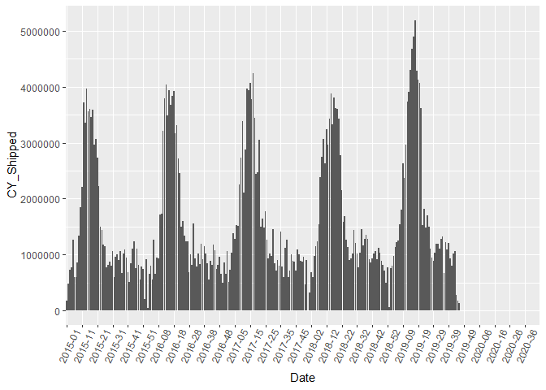<!-- -->

#### It's hard to tell but it looks like we are missing data at the end of our Date range. Let's check it out.

```r
kable(shipped_agg%>%
  group_by(Date)%>%
  summarize(count=n(),
            total = sum(CY_Shipped)))%>%
  kable_styling() %>%
  scroll_box(width = "500px", height = "200px")
```

<div style="border: 1px solid #ddd; padding: 0px; overflow-y: scroll; height:200px; overflow-x: scroll; width:500px; "><table class="table" style="margin-left: auto; margin-right: auto;">
 <thead>
  <tr>
   <th style="text-align:left;position: sticky; top:0; background-color: #FFFFFF;"> Date </th>
   <th style="text-align:right;position: sticky; top:0; background-color: #FFFFFF;"> count </th>
   <th style="text-align:right;position: sticky; top:0; background-color: #FFFFFF;"> total </th>
  </tr>
 </thead>
<tbody>
  <tr>
   <td style="text-align:left;"> 2015-01 </td>
   <td style="text-align:right;"> 1104 </td>
   <td style="text-align:right;"> 176314 </td>
  </tr>
  <tr>
   <td style="text-align:left;"> 2015-02 </td>
   <td style="text-align:right;"> 1025 </td>
   <td style="text-align:right;"> 475680 </td>
  </tr>
  <tr>
   <td style="text-align:left;"> 2015-03 </td>
   <td style="text-align:right;"> 1025 </td>
   <td style="text-align:right;"> 718916 </td>
  </tr>
  <tr>
   <td style="text-align:left;"> 2015-04 </td>
   <td style="text-align:right;"> 1034 </td>
   <td style="text-align:right;"> 768818 </td>
  </tr>
  <tr>
   <td style="text-align:left;"> 2015-05 </td>
   <td style="text-align:right;"> 1002 </td>
   <td style="text-align:right;"> 1265184 </td>
  </tr>
  <tr>
   <td style="text-align:left;"> 2015-06 </td>
   <td style="text-align:right;"> 1010 </td>
   <td style="text-align:right;"> 590407 </td>
  </tr>
  <tr>
   <td style="text-align:left;"> 2015-07 </td>
   <td style="text-align:right;"> 1040 </td>
   <td style="text-align:right;"> 589550 </td>
  </tr>
  <tr>
   <td style="text-align:left;"> 2015-08 </td>
   <td style="text-align:right;"> 1012 </td>
   <td style="text-align:right;"> 858661 </td>
  </tr>
  <tr>
   <td style="text-align:left;"> 2015-09 </td>
   <td style="text-align:right;"> 1024 </td>
   <td style="text-align:right;"> 1334855 </td>
  </tr>
  <tr>
   <td style="text-align:left;"> 2015-10 </td>
   <td style="text-align:right;"> 1022 </td>
   <td style="text-align:right;"> 1842944 </td>
  </tr>
  <tr>
   <td style="text-align:left;"> 2015-11 </td>
   <td style="text-align:right;"> 1034 </td>
   <td style="text-align:right;"> 2208468 </td>
  </tr>
  <tr>
   <td style="text-align:left;"> 2015-12 </td>
   <td style="text-align:right;"> 1043 </td>
   <td style="text-align:right;"> 3725464 </td>
  </tr>
  <tr>
   <td style="text-align:left;"> 2015-13 </td>
   <td style="text-align:right;"> 1059 </td>
   <td style="text-align:right;"> 3351484 </td>
  </tr>
  <tr>
   <td style="text-align:left;"> 2015-14 </td>
   <td style="text-align:right;"> 1074 </td>
   <td style="text-align:right;"> 3972595 </td>
  </tr>
  <tr>
   <td style="text-align:left;"> 2015-15 </td>
   <td style="text-align:right;"> 1080 </td>
   <td style="text-align:right;"> 3560389 </td>
  </tr>
  <tr>
   <td style="text-align:left;"> 2015-16 </td>
   <td style="text-align:right;"> 1100 </td>
   <td style="text-align:right;"> 3600819 </td>
  </tr>
  <tr>
   <td style="text-align:left;"> 2015-17 </td>
   <td style="text-align:right;"> 1117 </td>
   <td style="text-align:right;"> 3460655 </td>
  </tr>
  <tr>
   <td style="text-align:left;"> 2015-18 </td>
   <td style="text-align:right;"> 1117 </td>
   <td style="text-align:right;"> 3585257 </td>
  </tr>
  <tr>
   <td style="text-align:left;"> 2015-19 </td>
   <td style="text-align:right;"> 1120 </td>
   <td style="text-align:right;"> 2972426 </td>
  </tr>
  <tr>
   <td style="text-align:left;"> 2015-20 </td>
   <td style="text-align:right;"> 1129 </td>
   <td style="text-align:right;"> 3073670 </td>
  </tr>
  <tr>
   <td style="text-align:left;"> 2015-21 </td>
   <td style="text-align:right;"> 1125 </td>
   <td style="text-align:right;"> 2738860 </td>
  </tr>
  <tr>
   <td style="text-align:left;"> 2015-22 </td>
   <td style="text-align:right;"> 1112 </td>
   <td style="text-align:right;"> 2226360 </td>
  </tr>
  <tr>
   <td style="text-align:left;"> 2015-23 </td>
   <td style="text-align:right;"> 1118 </td>
   <td style="text-align:right;"> 1497526 </td>
  </tr>
  <tr>
   <td style="text-align:left;"> 2015-24 </td>
   <td style="text-align:right;"> 1112 </td>
   <td style="text-align:right;"> 1441926 </td>
  </tr>
  <tr>
   <td style="text-align:left;"> 2015-25 </td>
   <td style="text-align:right;"> 1128 </td>
   <td style="text-align:right;"> 1176588 </td>
  </tr>
  <tr>
   <td style="text-align:left;"> 2015-26 </td>
   <td style="text-align:right;"> 1106 </td>
   <td style="text-align:right;"> 1153929 </td>
  </tr>
  <tr>
   <td style="text-align:left;"> 2015-27 </td>
   <td style="text-align:right;"> 1114 </td>
   <td style="text-align:right;"> 776074 </td>
  </tr>
  <tr>
   <td style="text-align:left;"> 2015-28 </td>
   <td style="text-align:right;"> 1120 </td>
   <td style="text-align:right;"> 813471 </td>
  </tr>
  <tr>
   <td style="text-align:left;"> 2015-29 </td>
   <td style="text-align:right;"> 1128 </td>
   <td style="text-align:right;"> 868441 </td>
  </tr>
  <tr>
   <td style="text-align:left;"> 2015-30 </td>
   <td style="text-align:right;"> 1126 </td>
   <td style="text-align:right;"> 799869 </td>
  </tr>
  <tr>
   <td style="text-align:left;"> 2015-31 </td>
   <td style="text-align:right;"> 1110 </td>
   <td style="text-align:right;"> 1054440 </td>
  </tr>
  <tr>
   <td style="text-align:left;"> 2015-32 </td>
   <td style="text-align:right;"> 1111 </td>
   <td style="text-align:right;"> 594522 </td>
  </tr>
  <tr>
   <td style="text-align:left;"> 2015-33 </td>
   <td style="text-align:right;"> 1102 </td>
   <td style="text-align:right;"> 961393 </td>
  </tr>
  <tr>
   <td style="text-align:left;"> 2015-34 </td>
   <td style="text-align:right;"> 1114 </td>
   <td style="text-align:right;"> 1006242 </td>
  </tr>
  <tr>
   <td style="text-align:left;"> 2015-35 </td>
   <td style="text-align:right;"> 1095 </td>
   <td style="text-align:right;"> 900457 </td>
  </tr>
  <tr>
   <td style="text-align:left;"> 2015-36 </td>
   <td style="text-align:right;"> 1096 </td>
   <td style="text-align:right;"> 1056685 </td>
  </tr>
  <tr>
   <td style="text-align:left;"> 2015-37 </td>
   <td style="text-align:right;"> 1094 </td>
   <td style="text-align:right;"> 673180 </td>
  </tr>
  <tr>
   <td style="text-align:left;"> 2015-38 </td>
   <td style="text-align:right;"> 1102 </td>
   <td style="text-align:right;"> 1019734 </td>
  </tr>
  <tr>
   <td style="text-align:left;"> 2015-39 </td>
   <td style="text-align:right;"> 1106 </td>
   <td style="text-align:right;"> 1085217 </td>
  </tr>
  <tr>
   <td style="text-align:left;"> 2015-40 </td>
   <td style="text-align:right;"> 1106 </td>
   <td style="text-align:right;"> 943417 </td>
  </tr>
  <tr>
   <td style="text-align:left;"> 2015-41 </td>
   <td style="text-align:right;"> 1103 </td>
   <td style="text-align:right;"> 688043 </td>
  </tr>
  <tr>
   <td style="text-align:left;"> 2015-42 </td>
   <td style="text-align:right;"> 1107 </td>
   <td style="text-align:right;"> 508911 </td>
  </tr>
  <tr>
   <td style="text-align:left;"> 2015-43 </td>
   <td style="text-align:right;"> 1123 </td>
   <td style="text-align:right;"> 845380 </td>
  </tr>
  <tr>
   <td style="text-align:left;"> 2015-44 </td>
   <td style="text-align:right;"> 1111 </td>
   <td style="text-align:right;"> 1109528 </td>
  </tr>
  <tr>
   <td style="text-align:left;"> 2015-45 </td>
   <td style="text-align:right;"> 1115 </td>
   <td style="text-align:right;"> 1237812 </td>
  </tr>
  <tr>
   <td style="text-align:left;"> 2015-46 </td>
   <td style="text-align:right;"> 1106 </td>
   <td style="text-align:right;"> 756133 </td>
  </tr>
  <tr>
   <td style="text-align:left;"> 2015-47 </td>
   <td style="text-align:right;"> 1113 </td>
   <td style="text-align:right;"> 1096805 </td>
  </tr>
  <tr>
   <td style="text-align:left;"> 2015-48 </td>
   <td style="text-align:right;"> 1099 </td>
   <td style="text-align:right;"> 820066 </td>
  </tr>
  <tr>
   <td style="text-align:left;"> 2015-49 </td>
   <td style="text-align:right;"> 1096 </td>
   <td style="text-align:right;"> 553715 </td>
  </tr>
  <tr>
   <td style="text-align:left;"> 2015-50 </td>
   <td style="text-align:right;"> 1092 </td>
   <td style="text-align:right;"> 787819 </td>
  </tr>
  <tr>
   <td style="text-align:left;"> 2015-51 </td>
   <td style="text-align:right;"> 1096 </td>
   <td style="text-align:right;"> 734825 </td>
  </tr>
  <tr>
   <td style="text-align:left;"> 2015-52 </td>
   <td style="text-align:right;"> 1093 </td>
   <td style="text-align:right;"> 196751 </td>
  </tr>
  <tr>
   <td style="text-align:left;"> 2015-53 </td>
   <td style="text-align:right;"> 1090 </td>
   <td style="text-align:right;"> 922020 </td>
  </tr>
  <tr>
   <td style="text-align:left;"> 2016-01 </td>
   <td style="text-align:right;"> 1087 </td>
   <td style="text-align:right;"> 37166 </td>
  </tr>
  <tr>
   <td style="text-align:left;"> 2016-02 </td>
   <td style="text-align:right;"> 1087 </td>
   <td style="text-align:right;"> 651738 </td>
  </tr>
  <tr>
   <td style="text-align:left;"> 2016-03 </td>
   <td style="text-align:right;"> 1078 </td>
   <td style="text-align:right;"> 800541 </td>
  </tr>
  <tr>
   <td style="text-align:left;"> 2016-04 </td>
   <td style="text-align:right;"> 1053 </td>
   <td style="text-align:right;"> 547300 </td>
  </tr>
  <tr>
   <td style="text-align:left;"> 2016-05 </td>
   <td style="text-align:right;"> 1041 </td>
   <td style="text-align:right;"> 1266935 </td>
  </tr>
  <tr>
   <td style="text-align:left;"> 2016-06 </td>
   <td style="text-align:right;"> 1039 </td>
   <td style="text-align:right;"> 654449 </td>
  </tr>
  <tr>
   <td style="text-align:left;"> 2016-07 </td>
   <td style="text-align:right;"> 1022 </td>
   <td style="text-align:right;"> 943461 </td>
  </tr>
  <tr>
   <td style="text-align:left;"> 2016-08 </td>
   <td style="text-align:right;"> 1042 </td>
   <td style="text-align:right;"> 936292 </td>
  </tr>
  <tr>
   <td style="text-align:left;"> 2016-09 </td>
   <td style="text-align:right;"> 1049 </td>
   <td style="text-align:right;"> 1712264 </td>
  </tr>
  <tr>
   <td style="text-align:left;"> 2016-10 </td>
   <td style="text-align:right;"> 1063 </td>
   <td style="text-align:right;"> 1735562 </td>
  </tr>
  <tr>
   <td style="text-align:left;"> 2016-11 </td>
   <td style="text-align:right;"> 1066 </td>
   <td style="text-align:right;"> 3207721 </td>
  </tr>
  <tr>
   <td style="text-align:left;"> 2016-12 </td>
   <td style="text-align:right;"> 1092 </td>
   <td style="text-align:right;"> 3794607 </td>
  </tr>
  <tr>
   <td style="text-align:left;"> 2016-13 </td>
   <td style="text-align:right;"> 1091 </td>
   <td style="text-align:right;"> 4047196 </td>
  </tr>
  <tr>
   <td style="text-align:left;"> 2016-14 </td>
   <td style="text-align:right;"> 1105 </td>
   <td style="text-align:right;"> 3482648 </td>
  </tr>
  <tr>
   <td style="text-align:left;"> 2016-15 </td>
   <td style="text-align:right;"> 1122 </td>
   <td style="text-align:right;"> 3944928 </td>
  </tr>
  <tr>
   <td style="text-align:left;"> 2016-16 </td>
   <td style="text-align:right;"> 1141 </td>
   <td style="text-align:right;"> 3671362 </td>
  </tr>
  <tr>
   <td style="text-align:left;"> 2016-17 </td>
   <td style="text-align:right;"> 1154 </td>
   <td style="text-align:right;"> 3831141 </td>
  </tr>
  <tr>
   <td style="text-align:left;"> 2016-18 </td>
   <td style="text-align:right;"> 1154 </td>
   <td style="text-align:right;"> 3929474 </td>
  </tr>
  <tr>
   <td style="text-align:left;"> 2016-19 </td>
   <td style="text-align:right;"> 1159 </td>
   <td style="text-align:right;"> 3175573 </td>
  </tr>
  <tr>
   <td style="text-align:left;"> 2016-20 </td>
   <td style="text-align:right;"> 1168 </td>
   <td style="text-align:right;"> 3318393 </td>
  </tr>
  <tr>
   <td style="text-align:left;"> 2016-21 </td>
   <td style="text-align:right;"> 1168 </td>
   <td style="text-align:right;"> 2721664 </td>
  </tr>
  <tr>
   <td style="text-align:left;"> 2016-22 </td>
   <td style="text-align:right;"> 1168 </td>
   <td style="text-align:right;"> 2454912 </td>
  </tr>
  <tr>
   <td style="text-align:left;"> 2016-23 </td>
   <td style="text-align:right;"> 1166 </td>
   <td style="text-align:right;"> 1492611 </td>
  </tr>
  <tr>
   <td style="text-align:left;"> 2016-24 </td>
   <td style="text-align:right;"> 1172 </td>
   <td style="text-align:right;"> 1595307 </td>
  </tr>
  <tr>
   <td style="text-align:left;"> 2016-25 </td>
   <td style="text-align:right;"> 1171 </td>
   <td style="text-align:right;"> 1340768 </td>
  </tr>
  <tr>
   <td style="text-align:left;"> 2016-26 </td>
   <td style="text-align:right;"> 1166 </td>
   <td style="text-align:right;"> 1237812 </td>
  </tr>
  <tr>
   <td style="text-align:left;"> 2016-27 </td>
   <td style="text-align:right;"> 1160 </td>
   <td style="text-align:right;"> 1241507 </td>
  </tr>
  <tr>
   <td style="text-align:left;"> 2016-28 </td>
   <td style="text-align:right;"> 1160 </td>
   <td style="text-align:right;"> 676702 </td>
  </tr>
  <tr>
   <td style="text-align:left;"> 2016-29 </td>
   <td style="text-align:right;"> 1162 </td>
   <td style="text-align:right;"> 997467 </td>
  </tr>
  <tr>
   <td style="text-align:left;"> 2016-30 </td>
   <td style="text-align:right;"> 1153 </td>
   <td style="text-align:right;"> 813261 </td>
  </tr>
  <tr>
   <td style="text-align:left;"> 2016-31 </td>
   <td style="text-align:right;"> 1155 </td>
   <td style="text-align:right;"> 1560370 </td>
  </tr>
  <tr>
   <td style="text-align:left;"> 2016-32 </td>
   <td style="text-align:right;"> 1149 </td>
   <td style="text-align:right;"> 933326 </td>
  </tr>
  <tr>
   <td style="text-align:left;"> 2016-33 </td>
   <td style="text-align:right;"> 1140 </td>
   <td style="text-align:right;"> 782842 </td>
  </tr>
  <tr>
   <td style="text-align:left;"> 2016-34 </td>
   <td style="text-align:right;"> 1140 </td>
   <td style="text-align:right;"> 1013357 </td>
  </tr>
  <tr>
   <td style="text-align:left;"> 2016-35 </td>
   <td style="text-align:right;"> 1144 </td>
   <td style="text-align:right;"> 827290 </td>
  </tr>
  <tr>
   <td style="text-align:left;"> 2016-36 </td>
   <td style="text-align:right;"> 1149 </td>
   <td style="text-align:right;"> 1191819 </td>
  </tr>
  <tr>
   <td style="text-align:left;"> 2016-37 </td>
   <td style="text-align:right;"> 1146 </td>
   <td style="text-align:right;"> 908669 </td>
  </tr>
  <tr>
   <td style="text-align:left;"> 2016-38 </td>
   <td style="text-align:right;"> 1148 </td>
   <td style="text-align:right;"> 1151976 </td>
  </tr>
  <tr>
   <td style="text-align:left;"> 2016-39 </td>
   <td style="text-align:right;"> 1145 </td>
   <td style="text-align:right;"> 1014722 </td>
  </tr>
  <tr>
   <td style="text-align:left;"> 2016-40 </td>
   <td style="text-align:right;"> 1162 </td>
   <td style="text-align:right;"> 841974 </td>
  </tr>
  <tr>
   <td style="text-align:left;"> 2016-41 </td>
   <td style="text-align:right;"> 1142 </td>
   <td style="text-align:right;"> 547914 </td>
  </tr>
  <tr>
   <td style="text-align:left;"> 2016-42 </td>
   <td style="text-align:right;"> 1154 </td>
   <td style="text-align:right;"> 891777 </td>
  </tr>
  <tr>
   <td style="text-align:left;"> 2016-43 </td>
   <td style="text-align:right;"> 1157 </td>
   <td style="text-align:right;"> 806714 </td>
  </tr>
  <tr>
   <td style="text-align:left;"> 2016-44 </td>
   <td style="text-align:right;"> 1158 </td>
   <td style="text-align:right;"> 1171225 </td>
  </tr>
  <tr>
   <td style="text-align:left;"> 2016-45 </td>
   <td style="text-align:right;"> 1151 </td>
   <td style="text-align:right;"> 1077085 </td>
  </tr>
  <tr>
   <td style="text-align:left;"> 2016-46 </td>
   <td style="text-align:right;"> 1155 </td>
   <td style="text-align:right;"> 745533 </td>
  </tr>
  <tr>
   <td style="text-align:left;"> 2016-47 </td>
   <td style="text-align:right;"> 1149 </td>
   <td style="text-align:right;"> 812291 </td>
  </tr>
  <tr>
   <td style="text-align:left;"> 2016-48 </td>
   <td style="text-align:right;"> 1144 </td>
   <td style="text-align:right;"> 954714 </td>
  </tr>
  <tr>
   <td style="text-align:left;"> 2016-49 </td>
   <td style="text-align:right;"> 1140 </td>
   <td style="text-align:right;"> 647225 </td>
  </tr>
  <tr>
   <td style="text-align:left;"> 2016-50 </td>
   <td style="text-align:right;"> 1136 </td>
   <td style="text-align:right;"> 492482 </td>
  </tr>
  <tr>
   <td style="text-align:left;"> 2016-51 </td>
   <td style="text-align:right;"> 1131 </td>
   <td style="text-align:right;"> 857453 </td>
  </tr>
  <tr>
   <td style="text-align:left;"> 2016-52 </td>
   <td style="text-align:right;"> 1121 </td>
   <td style="text-align:right;"> 651736 </td>
  </tr>
  <tr>
   <td style="text-align:left;"> 2016-53 </td>
   <td style="text-align:right;"> 1116 </td>
   <td style="text-align:right;"> 1055611 </td>
  </tr>
  <tr>
   <td style="text-align:left;"> 2017-01 </td>
   <td style="text-align:right;"> 1104 </td>
   <td style="text-align:right;"> 507358 </td>
  </tr>
  <tr>
   <td style="text-align:left;"> 2017-02 </td>
   <td style="text-align:right;"> 1090 </td>
   <td style="text-align:right;"> 720732 </td>
  </tr>
  <tr>
   <td style="text-align:left;"> 2017-03 </td>
   <td style="text-align:right;"> 1077 </td>
   <td style="text-align:right;"> 1036649 </td>
  </tr>
  <tr>
   <td style="text-align:left;"> 2017-04 </td>
   <td style="text-align:right;"> 1085 </td>
   <td style="text-align:right;"> 1386120 </td>
  </tr>
  <tr>
   <td style="text-align:left;"> 2017-05 </td>
   <td style="text-align:right;"> 1083 </td>
   <td style="text-align:right;"> 1279695 </td>
  </tr>
  <tr>
   <td style="text-align:left;"> 2017-06 </td>
   <td style="text-align:right;"> 1094 </td>
   <td style="text-align:right;"> 1518976 </td>
  </tr>
  <tr>
   <td style="text-align:left;"> 2017-07 </td>
   <td style="text-align:right;"> 1084 </td>
   <td style="text-align:right;"> 1504738 </td>
  </tr>
  <tr>
   <td style="text-align:left;"> 2017-08 </td>
   <td style="text-align:right;"> 1104 </td>
   <td style="text-align:right;"> 2248669 </td>
  </tr>
  <tr>
   <td style="text-align:left;"> 2017-09 </td>
   <td style="text-align:right;"> 1103 </td>
   <td style="text-align:right;"> 2727403 </td>
  </tr>
  <tr>
   <td style="text-align:left;"> 2017-10 </td>
   <td style="text-align:right;"> 1096 </td>
   <td style="text-align:right;"> 3387558 </td>
  </tr>
  <tr>
   <td style="text-align:left;"> 2017-11 </td>
   <td style="text-align:right;"> 1116 </td>
   <td style="text-align:right;"> 2110491 </td>
  </tr>
  <tr>
   <td style="text-align:left;"> 2017-12 </td>
   <td style="text-align:right;"> 1116 </td>
   <td style="text-align:right;"> 2870845 </td>
  </tr>
  <tr>
   <td style="text-align:left;"> 2017-13 </td>
   <td style="text-align:right;"> 1102 </td>
   <td style="text-align:right;"> 3972457 </td>
  </tr>
  <tr>
   <td style="text-align:left;"> 2017-14 </td>
   <td style="text-align:right;"> 1117 </td>
   <td style="text-align:right;"> 3938165 </td>
  </tr>
  <tr>
   <td style="text-align:left;"> 2017-15 </td>
   <td style="text-align:right;"> 1145 </td>
   <td style="text-align:right;"> 4077093 </td>
  </tr>
  <tr>
   <td style="text-align:left;"> 2017-16 </td>
   <td style="text-align:right;"> 1147 </td>
   <td style="text-align:right;"> 3777769 </td>
  </tr>
  <tr>
   <td style="text-align:left;"> 2017-17 </td>
   <td style="text-align:right;"> 1164 </td>
   <td style="text-align:right;"> 4243976 </td>
  </tr>
  <tr>
   <td style="text-align:left;"> 2017-18 </td>
   <td style="text-align:right;"> 1147 </td>
   <td style="text-align:right;"> 3438270 </td>
  </tr>
  <tr>
   <td style="text-align:left;"> 2017-19 </td>
   <td style="text-align:right;"> 1164 </td>
   <td style="text-align:right;"> 2436509 </td>
  </tr>
  <tr>
   <td style="text-align:left;"> 2017-20 </td>
   <td style="text-align:right;"> 1150 </td>
   <td style="text-align:right;"> 2473438 </td>
  </tr>
  <tr>
   <td style="text-align:left;"> 2017-21 </td>
   <td style="text-align:right;"> 1144 </td>
   <td style="text-align:right;"> 3048414 </td>
  </tr>
  <tr>
   <td style="text-align:left;"> 2017-22 </td>
   <td style="text-align:right;"> 1139 </td>
   <td style="text-align:right;"> 1494081 </td>
  </tr>
  <tr>
   <td style="text-align:left;"> 2017-23 </td>
   <td style="text-align:right;"> 1128 </td>
   <td style="text-align:right;"> 1642386 </td>
  </tr>
  <tr>
   <td style="text-align:left;"> 2017-24 </td>
   <td style="text-align:right;"> 1138 </td>
   <td style="text-align:right;"> 1475733 </td>
  </tr>
  <tr>
   <td style="text-align:left;"> 2017-25 </td>
   <td style="text-align:right;"> 1127 </td>
   <td style="text-align:right;"> 1772163 </td>
  </tr>
  <tr>
   <td style="text-align:left;"> 2017-26 </td>
   <td style="text-align:right;"> 1127 </td>
   <td style="text-align:right;"> 1256671 </td>
  </tr>
  <tr>
   <td style="text-align:left;"> 2017-27 </td>
   <td style="text-align:right;"> 1118 </td>
   <td style="text-align:right;"> 927627 </td>
  </tr>
  <tr>
   <td style="text-align:left;"> 2017-28 </td>
   <td style="text-align:right;"> 1123 </td>
   <td style="text-align:right;"> 1020671 </td>
  </tr>
  <tr>
   <td style="text-align:left;"> 2017-29 </td>
   <td style="text-align:right;"> 1099 </td>
   <td style="text-align:right;"> 974178 </td>
  </tr>
  <tr>
   <td style="text-align:left;"> 2017-30 </td>
   <td style="text-align:right;"> 1109 </td>
   <td style="text-align:right;"> 1454635 </td>
  </tr>
  <tr>
   <td style="text-align:left;"> 2017-31 </td>
   <td style="text-align:right;"> 1107 </td>
   <td style="text-align:right;"> 843826 </td>
  </tr>
  <tr>
   <td style="text-align:left;"> 2017-32 </td>
   <td style="text-align:right;"> 1101 </td>
   <td style="text-align:right;"> 706822 </td>
  </tr>
  <tr>
   <td style="text-align:left;"> 2017-33 </td>
   <td style="text-align:right;"> 1114 </td>
   <td style="text-align:right;"> 898326 </td>
  </tr>
  <tr>
   <td style="text-align:left;"> 2017-34 </td>
   <td style="text-align:right;"> 1106 </td>
   <td style="text-align:right;"> 797766 </td>
  </tr>
  <tr>
   <td style="text-align:left;"> 2017-35 </td>
   <td style="text-align:right;"> 1107 </td>
   <td style="text-align:right;"> 1414836 </td>
  </tr>
  <tr>
   <td style="text-align:left;"> 2017-36 </td>
   <td style="text-align:right;"> 1101 </td>
   <td style="text-align:right;"> 785003 </td>
  </tr>
  <tr>
   <td style="text-align:left;"> 2017-37 </td>
   <td style="text-align:right;"> 1106 </td>
   <td style="text-align:right;"> 587984 </td>
  </tr>
  <tr>
   <td style="text-align:left;"> 2017-38 </td>
   <td style="text-align:right;"> 1092 </td>
   <td style="text-align:right;"> 1112209 </td>
  </tr>
  <tr>
   <td style="text-align:left;"> 2017-39 </td>
   <td style="text-align:right;"> 1101 </td>
   <td style="text-align:right;"> 1269767 </td>
  </tr>
  <tr>
   <td style="text-align:left;"> 2017-40 </td>
   <td style="text-align:right;"> 1094 </td>
   <td style="text-align:right;"> 602126 </td>
  </tr>
  <tr>
   <td style="text-align:left;"> 2017-41 </td>
   <td style="text-align:right;"> 1109 </td>
   <td style="text-align:right;"> 705206 </td>
  </tr>
  <tr>
   <td style="text-align:left;"> 2017-42 </td>
   <td style="text-align:right;"> 1099 </td>
   <td style="text-align:right;"> 1006947 </td>
  </tr>
  <tr>
   <td style="text-align:left;"> 2017-43 </td>
   <td style="text-align:right;"> 1098 </td>
   <td style="text-align:right;"> 891128 </td>
  </tr>
  <tr>
   <td style="text-align:left;"> 2017-44 </td>
   <td style="text-align:right;"> 1085 </td>
   <td style="text-align:right;"> 869906 </td>
  </tr>
  <tr>
   <td style="text-align:left;"> 2017-45 </td>
   <td style="text-align:right;"> 1081 </td>
   <td style="text-align:right;"> 705248 </td>
  </tr>
  <tr>
   <td style="text-align:left;"> 2017-46 </td>
   <td style="text-align:right;"> 1095 </td>
   <td style="text-align:right;"> 1094282 </td>
  </tr>
  <tr>
   <td style="text-align:left;"> 2017-47 </td>
   <td style="text-align:right;"> 1089 </td>
   <td style="text-align:right;"> 1001326 </td>
  </tr>
  <tr>
   <td style="text-align:left;"> 2017-48 </td>
   <td style="text-align:right;"> 1093 </td>
   <td style="text-align:right;"> 887124 </td>
  </tr>
  <tr>
   <td style="text-align:left;"> 2017-49 </td>
   <td style="text-align:right;"> 1084 </td>
   <td style="text-align:right;"> 872929 </td>
  </tr>
  <tr>
   <td style="text-align:left;"> 2017-50 </td>
   <td style="text-align:right;"> 1077 </td>
   <td style="text-align:right;"> 953712 </td>
  </tr>
  <tr>
   <td style="text-align:left;"> 2017-51 </td>
   <td style="text-align:right;"> 1056 </td>
   <td style="text-align:right;"> 463291 </td>
  </tr>
  <tr>
   <td style="text-align:left;"> 2017-52 </td>
   <td style="text-align:right;"> 1053 </td>
   <td style="text-align:right;"> 901877 </td>
  </tr>
  <tr>
   <td style="text-align:left;"> 2017-53 </td>
   <td style="text-align:right;"> 1038 </td>
   <td style="text-align:right;"> 0 </td>
  </tr>
  <tr>
   <td style="text-align:left;"> 2018-01 </td>
   <td style="text-align:right;"> 1060 </td>
   <td style="text-align:right;"> 325576 </td>
  </tr>
  <tr>
   <td style="text-align:left;"> 2018-02 </td>
   <td style="text-align:right;"> 1065 </td>
   <td style="text-align:right;"> 677086 </td>
  </tr>
  <tr>
   <td style="text-align:left;"> 2018-03 </td>
   <td style="text-align:right;"> 1054 </td>
   <td style="text-align:right;"> 594192 </td>
  </tr>
  <tr>
   <td style="text-align:left;"> 2018-04 </td>
   <td style="text-align:right;"> 1058 </td>
   <td style="text-align:right;"> 966243 </td>
  </tr>
  <tr>
   <td style="text-align:left;"> 2018-05 </td>
   <td style="text-align:right;"> 1048 </td>
   <td style="text-align:right;"> 1153339 </td>
  </tr>
  <tr>
   <td style="text-align:left;"> 2018-06 </td>
   <td style="text-align:right;"> 1059 </td>
   <td style="text-align:right;"> 1227725 </td>
  </tr>
  <tr>
   <td style="text-align:left;"> 2018-07 </td>
   <td style="text-align:right;"> 1068 </td>
   <td style="text-align:right;"> 1538160 </td>
  </tr>
  <tr>
   <td style="text-align:left;"> 2018-08 </td>
   <td style="text-align:right;"> 1074 </td>
   <td style="text-align:right;"> 2376844 </td>
  </tr>
  <tr>
   <td style="text-align:left;"> 2018-09 </td>
   <td style="text-align:right;"> 1082 </td>
   <td style="text-align:right;"> 2746304 </td>
  </tr>
  <tr>
   <td style="text-align:left;"> 2018-10 </td>
   <td style="text-align:right;"> 1077 </td>
   <td style="text-align:right;"> 3073629 </td>
  </tr>
  <tr>
   <td style="text-align:left;"> 2018-11 </td>
   <td style="text-align:right;"> 1090 </td>
   <td style="text-align:right;"> 2633524 </td>
  </tr>
  <tr>
   <td style="text-align:left;"> 2018-12 </td>
   <td style="text-align:right;"> 1088 </td>
   <td style="text-align:right;"> 3246326 </td>
  </tr>
  <tr>
   <td style="text-align:left;"> 2018-13 </td>
   <td style="text-align:right;"> 1081 </td>
   <td style="text-align:right;"> 2972258 </td>
  </tr>
  <tr>
   <td style="text-align:left;"> 2018-14 </td>
   <td style="text-align:right;"> 1084 </td>
   <td style="text-align:right;"> 3434567 </td>
  </tr>
  <tr>
   <td style="text-align:left;"> 2018-15 </td>
   <td style="text-align:right;"> 1091 </td>
   <td style="text-align:right;"> 3879499 </td>
  </tr>
  <tr>
   <td style="text-align:left;"> 2018-16 </td>
   <td style="text-align:right;"> 1082 </td>
   <td style="text-align:right;"> 3324898 </td>
  </tr>
  <tr>
   <td style="text-align:left;"> 2018-17 </td>
   <td style="text-align:right;"> 1106 </td>
   <td style="text-align:right;"> 3812500 </td>
  </tr>
  <tr>
   <td style="text-align:left;"> 2018-18 </td>
   <td style="text-align:right;"> 1098 </td>
   <td style="text-align:right;"> 3615039 </td>
  </tr>
  <tr>
   <td style="text-align:left;"> 2018-19 </td>
   <td style="text-align:right;"> 1113 </td>
   <td style="text-align:right;"> 3608791 </td>
  </tr>
  <tr>
   <td style="text-align:left;"> 2018-20 </td>
   <td style="text-align:right;"> 1126 </td>
   <td style="text-align:right;"> 3433668 </td>
  </tr>
  <tr>
   <td style="text-align:left;"> 2018-21 </td>
   <td style="text-align:right;"> 1118 </td>
   <td style="text-align:right;"> 2769745 </td>
  </tr>
  <tr>
   <td style="text-align:left;"> 2018-22 </td>
   <td style="text-align:right;"> 1105 </td>
   <td style="text-align:right;"> 2148625 </td>
  </tr>
  <tr>
   <td style="text-align:left;"> 2018-23 </td>
   <td style="text-align:right;"> 1102 </td>
   <td style="text-align:right;"> 1584570 </td>
  </tr>
  <tr>
   <td style="text-align:left;"> 2018-24 </td>
   <td style="text-align:right;"> 1111 </td>
   <td style="text-align:right;"> 1679610 </td>
  </tr>
  <tr>
   <td style="text-align:left;"> 2018-25 </td>
   <td style="text-align:right;"> 1106 </td>
   <td style="text-align:right;"> 1265381 </td>
  </tr>
  <tr>
   <td style="text-align:left;"> 2018-26 </td>
   <td style="text-align:right;"> 1101 </td>
   <td style="text-align:right;"> 1137080 </td>
  </tr>
  <tr>
   <td style="text-align:left;"> 2018-27 </td>
   <td style="text-align:right;"> 1101 </td>
   <td style="text-align:right;"> 901467 </td>
  </tr>
  <tr>
   <td style="text-align:left;"> 2018-28 </td>
   <td style="text-align:right;"> 1111 </td>
   <td style="text-align:right;"> 925816 </td>
  </tr>
  <tr>
   <td style="text-align:left;"> 2018-29 </td>
   <td style="text-align:right;"> 1099 </td>
   <td style="text-align:right;"> 1023262 </td>
  </tr>
  <tr>
   <td style="text-align:left;"> 2018-30 </td>
   <td style="text-align:right;"> 1095 </td>
   <td style="text-align:right;"> 1440600 </td>
  </tr>
  <tr>
   <td style="text-align:left;"> 2018-31 </td>
   <td style="text-align:right;"> 1088 </td>
   <td style="text-align:right;"> 1209750 </td>
  </tr>
  <tr>
   <td style="text-align:left;"> 2018-32 </td>
   <td style="text-align:right;"> 1089 </td>
   <td style="text-align:right;"> 1021708 </td>
  </tr>
  <tr>
   <td style="text-align:left;"> 2018-33 </td>
   <td style="text-align:right;"> 1105 </td>
   <td style="text-align:right;"> 766932 </td>
  </tr>
  <tr>
   <td style="text-align:left;"> 2018-34 </td>
   <td style="text-align:right;"> 1087 </td>
   <td style="text-align:right;"> 1035260 </td>
  </tr>
  <tr>
   <td style="text-align:left;"> 2018-35 </td>
   <td style="text-align:right;"> 1085 </td>
   <td style="text-align:right;"> 1446093 </td>
  </tr>
  <tr>
   <td style="text-align:left;"> 2018-36 </td>
   <td style="text-align:right;"> 1078 </td>
   <td style="text-align:right;"> 1162404 </td>
  </tr>
  <tr>
   <td style="text-align:left;"> 2018-37 </td>
   <td style="text-align:right;"> 1078 </td>
   <td style="text-align:right;"> 1282269 </td>
  </tr>
  <tr>
   <td style="text-align:left;"> 2018-38 </td>
   <td style="text-align:right;"> 1079 </td>
   <td style="text-align:right;"> 1345707 </td>
  </tr>
  <tr>
   <td style="text-align:left;"> 2018-39 </td>
   <td style="text-align:right;"> 1082 </td>
   <td style="text-align:right;"> 1284394 </td>
  </tr>
  <tr>
   <td style="text-align:left;"> 2018-40 </td>
   <td style="text-align:right;"> 1080 </td>
   <td style="text-align:right;"> 920550 </td>
  </tr>
  <tr>
   <td style="text-align:left;"> 2018-41 </td>
   <td style="text-align:right;"> 1076 </td>
   <td style="text-align:right;"> 857666 </td>
  </tr>
  <tr>
   <td style="text-align:left;"> 2018-42 </td>
   <td style="text-align:right;"> 1076 </td>
   <td style="text-align:right;"> 922532 </td>
  </tr>
  <tr>
   <td style="text-align:left;"> 2018-43 </td>
   <td style="text-align:right;"> 1074 </td>
   <td style="text-align:right;"> 1017598 </td>
  </tr>
  <tr>
   <td style="text-align:left;"> 2018-44 </td>
   <td style="text-align:right;"> 1069 </td>
   <td style="text-align:right;"> 1056534 </td>
  </tr>
  <tr>
   <td style="text-align:left;"> 2018-45 </td>
   <td style="text-align:right;"> 1069 </td>
   <td style="text-align:right;"> 915206 </td>
  </tr>
  <tr>
   <td style="text-align:left;"> 2018-46 </td>
   <td style="text-align:right;"> 1063 </td>
   <td style="text-align:right;"> 1117478 </td>
  </tr>
  <tr>
   <td style="text-align:left;"> 2018-47 </td>
   <td style="text-align:right;"> 1058 </td>
   <td style="text-align:right;"> 1032044 </td>
  </tr>
  <tr>
   <td style="text-align:left;"> 2018-48 </td>
   <td style="text-align:right;"> 1060 </td>
   <td style="text-align:right;"> 879955 </td>
  </tr>
  <tr>
   <td style="text-align:left;"> 2018-49 </td>
   <td style="text-align:right;"> 1052 </td>
   <td style="text-align:right;"> 813069 </td>
  </tr>
  <tr>
   <td style="text-align:left;"> 2018-50 </td>
   <td style="text-align:right;"> 1050 </td>
   <td style="text-align:right;"> 715880 </td>
  </tr>
  <tr>
   <td style="text-align:left;"> 2018-51 </td>
   <td style="text-align:right;"> 1047 </td>
   <td style="text-align:right;"> 493746 </td>
  </tr>
  <tr>
   <td style="text-align:left;"> 2018-52 </td>
   <td style="text-align:right;"> 1057 </td>
   <td style="text-align:right;"> 764003 </td>
  </tr>
  <tr>
   <td style="text-align:left;"> 2018-53 </td>
   <td style="text-align:right;"> 1044 </td>
   <td style="text-align:right;"> 57252 </td>
  </tr>
  <tr>
   <td style="text-align:left;"> 2019-01 </td>
   <td style="text-align:right;"> 1048 </td>
   <td style="text-align:right;"> 747982 </td>
  </tr>
  <tr>
   <td style="text-align:left;"> 2019-02 </td>
   <td style="text-align:right;"> 1048 </td>
   <td style="text-align:right;"> 794494 </td>
  </tr>
  <tr>
   <td style="text-align:left;"> 2019-03 </td>
   <td style="text-align:right;"> 1050 </td>
   <td style="text-align:right;"> 975622 </td>
  </tr>
  <tr>
   <td style="text-align:left;"> 2019-04 </td>
   <td style="text-align:right;"> 1052 </td>
   <td style="text-align:right;"> 1129077 </td>
  </tr>
  <tr>
   <td style="text-align:left;"> 2019-05 </td>
   <td style="text-align:right;"> 1053 </td>
   <td style="text-align:right;"> 1220011 </td>
  </tr>
  <tr>
   <td style="text-align:left;"> 2019-06 </td>
   <td style="text-align:right;"> 1045 </td>
   <td style="text-align:right;"> 1253905 </td>
  </tr>
  <tr>
   <td style="text-align:left;"> 2019-07 </td>
   <td style="text-align:right;"> 1044 </td>
   <td style="text-align:right;"> 1541032 </td>
  </tr>
  <tr>
   <td style="text-align:left;"> 2019-08 </td>
   <td style="text-align:right;"> 1049 </td>
   <td style="text-align:right;"> 1803261 </td>
  </tr>
  <tr>
   <td style="text-align:left;"> 2019-09 </td>
   <td style="text-align:right;"> 1051 </td>
   <td style="text-align:right;"> 2636057 </td>
  </tr>
  <tr>
   <td style="text-align:left;"> 2019-10 </td>
   <td style="text-align:right;"> 1044 </td>
   <td style="text-align:right;"> 2370363 </td>
  </tr>
  <tr>
   <td style="text-align:left;"> 2019-11 </td>
   <td style="text-align:right;"> 1047 </td>
   <td style="text-align:right;"> 2961700 </td>
  </tr>
  <tr>
   <td style="text-align:left;"> 2019-12 </td>
   <td style="text-align:right;"> 1049 </td>
   <td style="text-align:right;"> 3730900 </td>
  </tr>
  <tr>
   <td style="text-align:left;"> 2019-13 </td>
   <td style="text-align:right;"> 1051 </td>
   <td style="text-align:right;"> 3904287 </td>
  </tr>
  <tr>
   <td style="text-align:left;"> 2019-14 </td>
   <td style="text-align:right;"> 1057 </td>
   <td style="text-align:right;"> 4309552 </td>
  </tr>
  <tr>
   <td style="text-align:left;"> 2019-15 </td>
   <td style="text-align:right;"> 1053 </td>
   <td style="text-align:right;"> 4676142 </td>
  </tr>
  <tr>
   <td style="text-align:left;"> 2019-16 </td>
   <td style="text-align:right;"> 1071 </td>
   <td style="text-align:right;"> 4897571 </td>
  </tr>
  <tr>
   <td style="text-align:left;"> 2019-17 </td>
   <td style="text-align:right;"> 1086 </td>
   <td style="text-align:right;"> 5194951 </td>
  </tr>
  <tr>
   <td style="text-align:left;"> 2019-18 </td>
   <td style="text-align:right;"> 1097 </td>
   <td style="text-align:right;"> 4291125 </td>
  </tr>
  <tr>
   <td style="text-align:left;"> 2019-19 </td>
   <td style="text-align:right;"> 1100 </td>
   <td style="text-align:right;"> 4127173 </td>
  </tr>
  <tr>
   <td style="text-align:left;"> 2019-20 </td>
   <td style="text-align:right;"> 1127 </td>
   <td style="text-align:right;"> 4065942 </td>
  </tr>
  <tr>
   <td style="text-align:left;"> 2019-21 </td>
   <td style="text-align:right;"> 1125 </td>
   <td style="text-align:right;"> 3623816 </td>
  </tr>
  <tr>
   <td style="text-align:left;"> 2019-22 </td>
   <td style="text-align:right;"> 1127 </td>
   <td style="text-align:right;"> 1523581 </td>
  </tr>
  <tr>
   <td style="text-align:left;"> 2019-23 </td>
   <td style="text-align:right;"> 1122 </td>
   <td style="text-align:right;"> 1822741 </td>
  </tr>
  <tr>
   <td style="text-align:left;"> 2019-24 </td>
   <td style="text-align:right;"> 1241 </td>
   <td style="text-align:right;"> 1480971 </td>
  </tr>
  <tr>
   <td style="text-align:left;"> 2019-25 </td>
   <td style="text-align:right;"> 1245 </td>
   <td style="text-align:right;"> 1700950 </td>
  </tr>
  <tr>
   <td style="text-align:left;"> 2019-26 </td>
   <td style="text-align:right;"> 1235 </td>
   <td style="text-align:right;"> 1492285 </td>
  </tr>
  <tr>
   <td style="text-align:left;"> 2019-27 </td>
   <td style="text-align:right;"> 1235 </td>
   <td style="text-align:right;"> 1098727 </td>
  </tr>
  <tr>
   <td style="text-align:left;"> 2019-28 </td>
   <td style="text-align:right;"> 1233 </td>
   <td style="text-align:right;"> 941500 </td>
  </tr>
  <tr>
   <td style="text-align:left;"> 2019-29 </td>
   <td style="text-align:right;"> 1230 </td>
   <td style="text-align:right;"> 893052 </td>
  </tr>
  <tr>
   <td style="text-align:left;"> 2019-30 </td>
   <td style="text-align:right;"> 1232 </td>
   <td style="text-align:right;"> 1025655 </td>
  </tr>
  <tr>
   <td style="text-align:left;"> 2019-31 </td>
   <td style="text-align:right;"> 1239 </td>
   <td style="text-align:right;"> 1186058 </td>
  </tr>
  <tr>
   <td style="text-align:left;"> 2019-32 </td>
   <td style="text-align:right;"> 1228 </td>
   <td style="text-align:right;"> 1189090 </td>
  </tr>
  <tr>
   <td style="text-align:left;"> 2019-33 </td>
   <td style="text-align:right;"> 1230 </td>
   <td style="text-align:right;"> 1106885 </td>
  </tr>
  <tr>
   <td style="text-align:left;"> 2019-34 </td>
   <td style="text-align:right;"> 1230 </td>
   <td style="text-align:right;"> 1274547 </td>
  </tr>
  <tr>
   <td style="text-align:left;"> 2019-35 </td>
   <td style="text-align:right;"> 1229 </td>
   <td style="text-align:right;"> 1322772 </td>
  </tr>
  <tr>
   <td style="text-align:left;"> 2019-36 </td>
   <td style="text-align:right;"> 1229 </td>
   <td style="text-align:right;"> 671083 </td>
  </tr>
  <tr>
   <td style="text-align:left;"> 2019-37 </td>
   <td style="text-align:right;"> 1225 </td>
   <td style="text-align:right;"> 1216611 </td>
  </tr>
  <tr>
   <td style="text-align:left;"> 2019-38 </td>
   <td style="text-align:right;"> 1228 </td>
   <td style="text-align:right;"> 1091560 </td>
  </tr>
  <tr>
   <td style="text-align:left;"> 2019-39 </td>
   <td style="text-align:right;"> 1226 </td>
   <td style="text-align:right;"> 1208336 </td>
  </tr>
  <tr>
   <td style="text-align:left;"> 2019-40 </td>
   <td style="text-align:right;"> 1228 </td>
   <td style="text-align:right;"> 935742 </td>
  </tr>
  <tr>
   <td style="text-align:left;"> 2019-41 </td>
   <td style="text-align:right;"> 1224 </td>
   <td style="text-align:right;"> 802683 </td>
  </tr>
  <tr>
   <td style="text-align:left;"> 2019-42 </td>
   <td style="text-align:right;"> 1230 </td>
   <td style="text-align:right;"> 1011143 </td>
  </tr>
  <tr>
   <td style="text-align:left;"> 2019-43 </td>
   <td style="text-align:right;"> 1234 </td>
   <td style="text-align:right;"> 1060517 </td>
  </tr>
  <tr>
   <td style="text-align:left;"> 2019-44 </td>
   <td style="text-align:right;"> 554 </td>
   <td style="text-align:right;"> 273411 </td>
  </tr>
  <tr>
   <td style="text-align:left;"> 2019-45 </td>
   <td style="text-align:right;"> 497 </td>
   <td style="text-align:right;"> 167728 </td>
  </tr>
  <tr>
   <td style="text-align:left;"> 2019-46 </td>
   <td style="text-align:right;"> 476 </td>
   <td style="text-align:right;"> 136748 </td>
  </tr>
  <tr>
   <td style="text-align:left;"> 2019-47 </td>
   <td style="text-align:right;"> 410 </td>
   <td style="text-align:right;"> 0 </td>
  </tr>
  <tr>
   <td style="text-align:left;"> 2019-48 </td>
   <td style="text-align:right;"> 442 </td>
   <td style="text-align:right;"> 0 </td>
  </tr>
  <tr>
   <td style="text-align:left;"> 2019-49 </td>
   <td style="text-align:right;"> 427 </td>
   <td style="text-align:right;"> 0 </td>
  </tr>
  <tr>
   <td style="text-align:left;"> 2019-50 </td>
   <td style="text-align:right;"> 368 </td>
   <td style="text-align:right;"> 0 </td>
  </tr>
  <tr>
   <td style="text-align:left;"> 2019-51 </td>
   <td style="text-align:right;"> 435 </td>
   <td style="text-align:right;"> 0 </td>
  </tr>
  <tr>
   <td style="text-align:left;"> 2019-52 </td>
   <td style="text-align:right;"> 457 </td>
   <td style="text-align:right;"> 0 </td>
  </tr>
  <tr>
   <td style="text-align:left;"> 2019-53 </td>
   <td style="text-align:right;"> 282 </td>
   <td style="text-align:right;"> 34 </td>
  </tr>
  <tr>
   <td style="text-align:left;"> 2020-01 </td>
   <td style="text-align:right;"> 355 </td>
   <td style="text-align:right;"> 0 </td>
  </tr>
  <tr>
   <td style="text-align:left;"> 2020-02 </td>
   <td style="text-align:right;"> 525 </td>
   <td style="text-align:right;"> 0 </td>
  </tr>
  <tr>
   <td style="text-align:left;"> 2020-03 </td>
   <td style="text-align:right;"> 537 </td>
   <td style="text-align:right;"> 0 </td>
  </tr>
  <tr>
   <td style="text-align:left;"> 2020-04 </td>
   <td style="text-align:right;"> 528 </td>
   <td style="text-align:right;"> 0 </td>
  </tr>
  <tr>
   <td style="text-align:left;"> 2020-05 </td>
   <td style="text-align:right;"> 563 </td>
   <td style="text-align:right;"> 0 </td>
  </tr>
  <tr>
   <td style="text-align:left;"> 2020-06 </td>
   <td style="text-align:right;"> 587 </td>
   <td style="text-align:right;"> 0 </td>
  </tr>
  <tr>
   <td style="text-align:left;"> 2020-07 </td>
   <td style="text-align:right;"> 620 </td>
   <td style="text-align:right;"> 0 </td>
  </tr>
  <tr>
   <td style="text-align:left;"> 2020-08 </td>
   <td style="text-align:right;"> 607 </td>
   <td style="text-align:right;"> 0 </td>
  </tr>
  <tr>
   <td style="text-align:left;"> 2020-09 </td>
   <td style="text-align:right;"> 594 </td>
   <td style="text-align:right;"> 0 </td>
  </tr>
  <tr>
   <td style="text-align:left;"> 2020-10 </td>
   <td style="text-align:right;"> 664 </td>
   <td style="text-align:right;"> 0 </td>
  </tr>
  <tr>
   <td style="text-align:left;"> 2020-11 </td>
   <td style="text-align:right;"> 679 </td>
   <td style="text-align:right;"> 0 </td>
  </tr>
  <tr>
   <td style="text-align:left;"> 2020-12 </td>
   <td style="text-align:right;"> 698 </td>
   <td style="text-align:right;"> 0 </td>
  </tr>
  <tr>
   <td style="text-align:left;"> 2020-13 </td>
   <td style="text-align:right;"> 724 </td>
   <td style="text-align:right;"> 0 </td>
  </tr>
  <tr>
   <td style="text-align:left;"> 2020-14 </td>
   <td style="text-align:right;"> 707 </td>
   <td style="text-align:right;"> 0 </td>
  </tr>
  <tr>
   <td style="text-align:left;"> 2020-15 </td>
   <td style="text-align:right;"> 709 </td>
   <td style="text-align:right;"> 0 </td>
  </tr>
  <tr>
   <td style="text-align:left;"> 2020-16 </td>
   <td style="text-align:right;"> 731 </td>
   <td style="text-align:right;"> 0 </td>
  </tr>
  <tr>
   <td style="text-align:left;"> 2020-17 </td>
   <td style="text-align:right;"> 710 </td>
   <td style="text-align:right;"> 0 </td>
  </tr>
  <tr>
   <td style="text-align:left;"> 2020-18 </td>
   <td style="text-align:right;"> 735 </td>
   <td style="text-align:right;"> 0 </td>
  </tr>
  <tr>
   <td style="text-align:left;"> 2020-19 </td>
   <td style="text-align:right;"> 714 </td>
   <td style="text-align:right;"> 0 </td>
  </tr>
  <tr>
   <td style="text-align:left;"> 2020-20 </td>
   <td style="text-align:right;"> 686 </td>
   <td style="text-align:right;"> 0 </td>
  </tr>
  <tr>
   <td style="text-align:left;"> 2020-21 </td>
   <td style="text-align:right;"> 700 </td>
   <td style="text-align:right;"> 0 </td>
  </tr>
  <tr>
   <td style="text-align:left;"> 2020-22 </td>
   <td style="text-align:right;"> 555 </td>
   <td style="text-align:right;"> 0 </td>
  </tr>
  <tr>
   <td style="text-align:left;"> 2020-23 </td>
   <td style="text-align:right;"> 612 </td>
   <td style="text-align:right;"> 0 </td>
  </tr>
  <tr>
   <td style="text-align:left;"> 2020-24 </td>
   <td style="text-align:right;"> 632 </td>
   <td style="text-align:right;"> 0 </td>
  </tr>
  <tr>
   <td style="text-align:left;"> 2020-25 </td>
   <td style="text-align:right;"> 647 </td>
   <td style="text-align:right;"> 0 </td>
  </tr>
  <tr>
   <td style="text-align:left;"> 2020-26 </td>
   <td style="text-align:right;"> 622 </td>
   <td style="text-align:right;"> 0 </td>
  </tr>
  <tr>
   <td style="text-align:left;"> 2020-27 </td>
   <td style="text-align:right;"> 580 </td>
   <td style="text-align:right;"> 0 </td>
  </tr>
  <tr>
   <td style="text-align:left;"> 2020-28 </td>
   <td style="text-align:right;"> 547 </td>
   <td style="text-align:right;"> 0 </td>
  </tr>
  <tr>
   <td style="text-align:left;"> 2020-29 </td>
   <td style="text-align:right;"> 559 </td>
   <td style="text-align:right;"> 0 </td>
  </tr>
  <tr>
   <td style="text-align:left;"> 2020-30 </td>
   <td style="text-align:right;"> 531 </td>
   <td style="text-align:right;"> 0 </td>
  </tr>
  <tr>
   <td style="text-align:left;"> 2020-31 </td>
   <td style="text-align:right;"> 577 </td>
   <td style="text-align:right;"> 0 </td>
  </tr>
  <tr>
   <td style="text-align:left;"> 2020-32 </td>
   <td style="text-align:right;"> 583 </td>
   <td style="text-align:right;"> 0 </td>
  </tr>
  <tr>
   <td style="text-align:left;"> 2020-33 </td>
   <td style="text-align:right;"> 561 </td>
   <td style="text-align:right;"> 0 </td>
  </tr>
  <tr>
   <td style="text-align:left;"> 2020-34 </td>
   <td style="text-align:right;"> 618 </td>
   <td style="text-align:right;"> 0 </td>
  </tr>
  <tr>
   <td style="text-align:left;"> 2020-35 </td>
   <td style="text-align:right;"> 620 </td>
   <td style="text-align:right;"> 0 </td>
  </tr>
  <tr>
   <td style="text-align:left;"> 2020-36 </td>
   <td style="text-align:right;"> 442 </td>
   <td style="text-align:right;"> 0 </td>
  </tr>
  <tr>
   <td style="text-align:left;"> 2020-37 </td>
   <td style="text-align:right;"> 525 </td>
   <td style="text-align:right;"> 0 </td>
  </tr>
  <tr>
   <td style="text-align:left;"> 2020-38 </td>
   <td style="text-align:right;"> 528 </td>
   <td style="text-align:right;"> 0 </td>
  </tr>
  <tr>
   <td style="text-align:left;"> 2020-39 </td>
   <td style="text-align:right;"> 517 </td>
   <td style="text-align:right;"> 0 </td>
  </tr>
  <tr>
   <td style="text-align:left;"> 2020-40 </td>
   <td style="text-align:right;"> 504 </td>
   <td style="text-align:right;"> 0 </td>
  </tr>
  <tr>
   <td style="text-align:left;"> 2020-41 </td>
   <td style="text-align:right;"> 462 </td>
   <td style="text-align:right;"> 0 </td>
  </tr>
  <tr>
   <td style="text-align:left;"> 2020-42 </td>
   <td style="text-align:right;"> 483 </td>
   <td style="text-align:right;"> 0 </td>
  </tr>
  <tr>
   <td style="text-align:left;"> 2020-43 </td>
   <td style="text-align:right;"> 487 </td>
   <td style="text-align:right;"> 0 </td>
  </tr>
  <tr>
   <td style="text-align:left;"> 2020-44 </td>
   <td style="text-align:right;"> 377 </td>
   <td style="text-align:right;"> 0 </td>
  </tr>
  <tr>
   <td style="text-align:left;"> 2020-45 </td>
   <td style="text-align:right;"> 42 </td>
   <td style="text-align:right;"> 0 </td>
  </tr>
</tbody>
</table></div>

```r
shipped_agg <- shipped_agg%>%
  filter(as.integer(Date) %in% c(1:255))%>%
  droplevels
```

#### Let's check it out again. Looks good!

```r
my_breaks <- seq(1,length(unique(shipped_agg$Date)),by=10)

ggplot(shipped_agg, aes(x = Date, y=CY_Shipped )) +
  geom_bar(stat="identity") +
  theme(axis.text.x = element_text(angle=65, vjust=0.6))+
  scale_x_discrete(
    breaks=levels(shipped_agg$Date)[my_breaks])
```

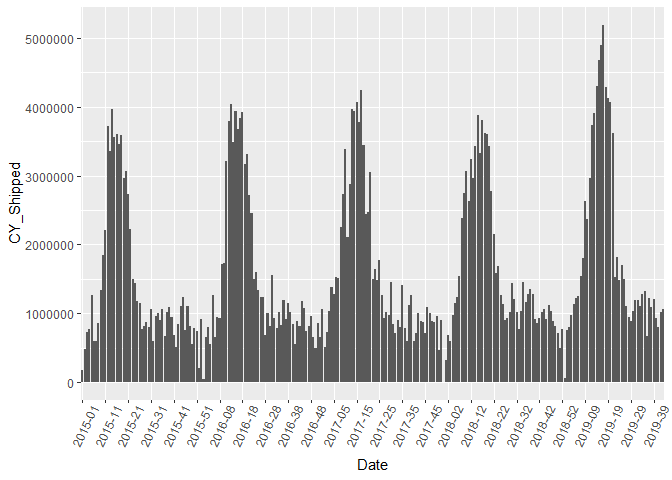<!-- -->


#### By Year

```r
ggplot(shipped_agg, aes(x = Date.Fiscal.Year., y=CY_Shipped )) +
  geom_bar(stat="identity") +
  theme(axis.text.x = element_text(angle=65, vjust=0.6))
```

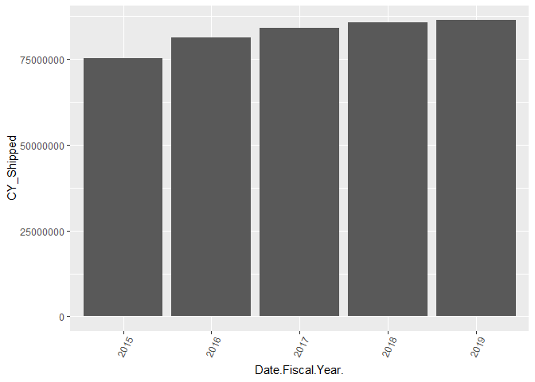<!-- -->


#### By Week

```r
ggplot(shipped_agg, aes(x = Date.Fiscal.Week. , y= CY_Shipped)) +
  geom_bar(stat="identity") +
  theme(axis.text.x = element_text(angle=65, vjust=0.6))
```

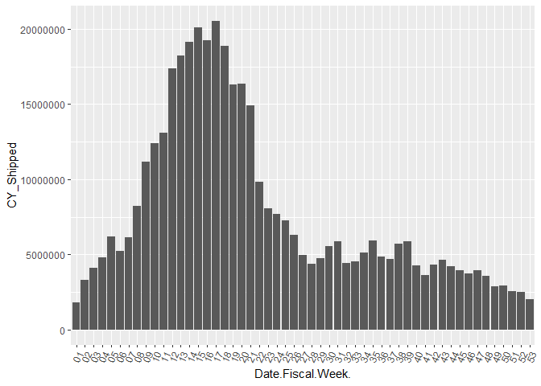<!-- -->


#### By Customer

```r
ggplot(shipped_agg, aes(x = Customer.Customer. , y= CY_Shipped)) +
  geom_bar(stat="identity") +
  theme(axis.text.x = element_text(angle=65, vjust=0.6))
```

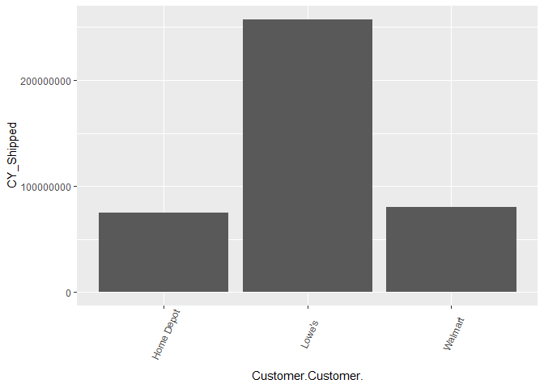<!-- -->


#### By Store Sub Region

```r
ggplot(shipped_agg, aes(x = Store.Sub.Region. , y= CY_Shipped)) +
  geom_bar(stat="identity") +
  theme(axis.text.x = element_text(angle=65, vjust=0.6))
```

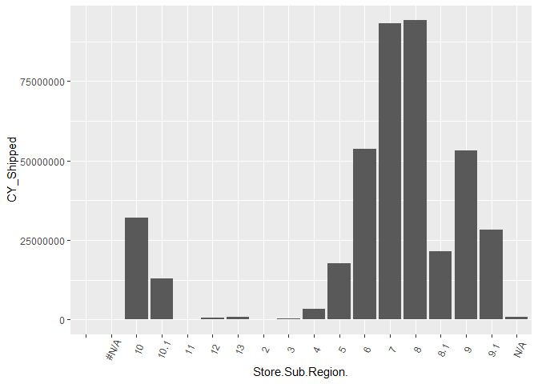<!-- -->


#### It looks like we need to get rid of blank and n/a levels in Store Region

```r
kable(shipped_agg%>%
  group_by(Store.Sub.Region.)%>%
  summarize(count=n(),
            total = sum(CY_Shipped),
            ave=mean(CY_Shipped)))%>%
  kable_styling() %>%
  scroll_box(width = "500px", height = "200px")
```

<div style="border: 1px solid #ddd; padding: 0px; overflow-y: scroll; height:200px; overflow-x: scroll; width:500px; "><table class="table" style="margin-left: auto; margin-right: auto;">
 <thead>
  <tr>
   <th style="text-align:left;position: sticky; top:0; background-color: #FFFFFF;"> Store.Sub.Region. </th>
   <th style="text-align:right;position: sticky; top:0; background-color: #FFFFFF;"> count </th>
   <th style="text-align:right;position: sticky; top:0; background-color: #FFFFFF;"> total </th>
   <th style="text-align:right;position: sticky; top:0; background-color: #FFFFFF;"> ave </th>
  </tr>
 </thead>
<tbody>
  <tr>
   <td style="text-align:left;">  </td>
   <td style="text-align:right;"> 157 </td>
   <td style="text-align:right;"> 0 </td>
   <td style="text-align:right;"> 0.000000 </td>
  </tr>
  <tr>
   <td style="text-align:left;"> #N/A </td>
   <td style="text-align:right;"> 174 </td>
   <td style="text-align:right;"> 0 </td>
   <td style="text-align:right;"> 0.000000 </td>
  </tr>
  <tr>
   <td style="text-align:left;"> 10 </td>
   <td style="text-align:right;"> 24832 </td>
   <td style="text-align:right;"> 32071188 </td>
   <td style="text-align:right;"> 1291.526579 </td>
  </tr>
  <tr>
   <td style="text-align:left;"> 10.1 </td>
   <td style="text-align:right;"> 22568 </td>
   <td style="text-align:right;"> 12992922 </td>
   <td style="text-align:right;"> 575.723236 </td>
  </tr>
  <tr>
   <td style="text-align:left;"> 11 </td>
   <td style="text-align:right;"> 7575 </td>
   <td style="text-align:right;"> 136303 </td>
   <td style="text-align:right;"> 17.993795 </td>
  </tr>
  <tr>
   <td style="text-align:left;"> 12 </td>
   <td style="text-align:right;"> 6878 </td>
   <td style="text-align:right;"> 540728 </td>
   <td style="text-align:right;"> 78.617040 </td>
  </tr>
  <tr>
   <td style="text-align:left;"> 13 </td>
   <td style="text-align:right;"> 7092 </td>
   <td style="text-align:right;"> 797166 </td>
   <td style="text-align:right;"> 112.403553 </td>
  </tr>
  <tr>
   <td style="text-align:left;"> 2 </td>
   <td style="text-align:right;"> 707 </td>
   <td style="text-align:right;"> 1187 </td>
   <td style="text-align:right;"> 1.678925 </td>
  </tr>
  <tr>
   <td style="text-align:left;"> 3 </td>
   <td style="text-align:right;"> 10708 </td>
   <td style="text-align:right;"> 202581 </td>
   <td style="text-align:right;"> 18.918659 </td>
  </tr>
  <tr>
   <td style="text-align:left;"> 4 </td>
   <td style="text-align:right;"> 17334 </td>
   <td style="text-align:right;"> 3433286 </td>
   <td style="text-align:right;"> 198.066574 </td>
  </tr>
  <tr>
   <td style="text-align:left;"> 5 </td>
   <td style="text-align:right;"> 19491 </td>
   <td style="text-align:right;"> 17632493 </td>
   <td style="text-align:right;"> 904.647940 </td>
  </tr>
  <tr>
   <td style="text-align:left;"> 6 </td>
   <td style="text-align:right;"> 22677 </td>
   <td style="text-align:right;"> 53715734 </td>
   <td style="text-align:right;"> 2368.731931 </td>
  </tr>
  <tr>
   <td style="text-align:left;"> 7 </td>
   <td style="text-align:right;"> 27946 </td>
   <td style="text-align:right;"> 93250596 </td>
   <td style="text-align:right;"> 3336.813712 </td>
  </tr>
  <tr>
   <td style="text-align:left;"> 8 </td>
   <td style="text-align:right;"> 28444 </td>
   <td style="text-align:right;"> 94140291 </td>
   <td style="text-align:right;"> 3309.671319 </td>
  </tr>
  <tr>
   <td style="text-align:left;"> 8.1 </td>
   <td style="text-align:right;"> 24132 </td>
   <td style="text-align:right;"> 21391450 </td>
   <td style="text-align:right;"> 886.435024 </td>
  </tr>
  <tr>
   <td style="text-align:left;"> 9 </td>
   <td style="text-align:right;"> 26022 </td>
   <td style="text-align:right;"> 53115353 </td>
   <td style="text-align:right;"> 2041.171048 </td>
  </tr>
  <tr>
   <td style="text-align:left;"> 9.1 </td>
   <td style="text-align:right;"> 23708 </td>
   <td style="text-align:right;"> 28201860 </td>
   <td style="text-align:right;"> 1189.550363 </td>
  </tr>
  <tr>
   <td style="text-align:left;"> N/A </td>
   <td style="text-align:right;"> 12238 </td>
   <td style="text-align:right;"> 795341 </td>
   <td style="text-align:right;"> 64.989459 </td>
  </tr>
</tbody>
</table></div>

```r
shipped_agg <- shipped_agg%>%
  filter(!Store.Sub.Region. %in% c("","#N/A",'2'))%>%
  droplevels
```


#### By Product Category

```r
ggplot(shipped_agg, aes(x = Product.Category. , y= CY_Shipped)) +
  geom_bar(stat="identity") +
  theme(axis.text.x = element_text(angle=65, vjust=0.6))
```

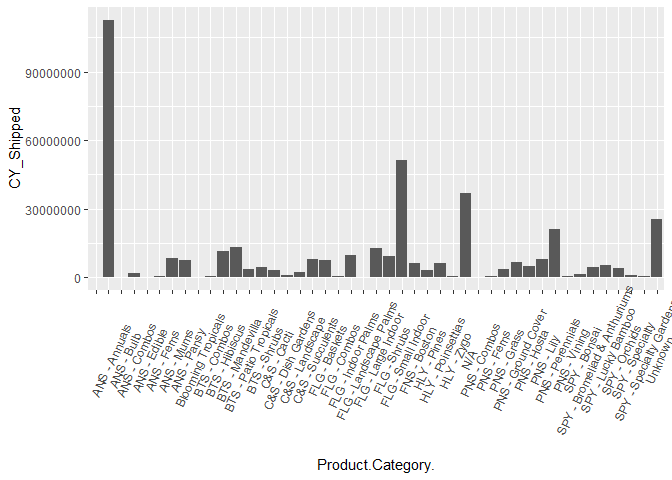<!-- -->


#### It looks like we need to get rid of a blank level in Product Category

```r
kable(shipped_agg%>%
  group_by(Product.Category.)%>%
  summarize(count=n(),
            total = sum(CY_Shipped)))%>%
  kable_styling() %>%
  scroll_box(width = "500px", height = "200px")
```

<div style="border: 1px solid #ddd; padding: 0px; overflow-y: scroll; height:200px; overflow-x: scroll; width:500px; "><table class="table" style="margin-left: auto; margin-right: auto;">
 <thead>
  <tr>
   <th style="text-align:left;position: sticky; top:0; background-color: #FFFFFF;"> Product.Category. </th>
   <th style="text-align:right;position: sticky; top:0; background-color: #FFFFFF;"> count </th>
   <th style="text-align:right;position: sticky; top:0; background-color: #FFFFFF;"> total </th>
  </tr>
 </thead>
<tbody>
  <tr>
   <td style="text-align:left;">  </td>
   <td style="text-align:right;"> 130 </td>
   <td style="text-align:right;"> 0 </td>
  </tr>
  <tr>
   <td style="text-align:left;"> ANS - Annuals </td>
   <td style="text-align:right;"> 5255 </td>
   <td style="text-align:right;"> 112779933 </td>
  </tr>
  <tr>
   <td style="text-align:left;"> ANS - Bulb </td>
   <td style="text-align:right;"> 1236 </td>
   <td style="text-align:right;"> 160781 </td>
  </tr>
  <tr>
   <td style="text-align:left;"> ANS - Combos </td>
   <td style="text-align:right;"> 3740 </td>
   <td style="text-align:right;"> 1770680 </td>
  </tr>
  <tr>
   <td style="text-align:left;"> ANS - Edible </td>
   <td style="text-align:right;"> 1933 </td>
   <td style="text-align:right;"> 42887 </td>
  </tr>
  <tr>
   <td style="text-align:left;"> ANS - Ferns </td>
   <td style="text-align:right;"> 2283 </td>
   <td style="text-align:right;"> 511271 </td>
  </tr>
  <tr>
   <td style="text-align:left;"> ANS - Mums </td>
   <td style="text-align:right;"> 4079 </td>
   <td style="text-align:right;"> 8451513 </td>
  </tr>
  <tr>
   <td style="text-align:left;"> ANS - Pansy </td>
   <td style="text-align:right;"> 2914 </td>
   <td style="text-align:right;"> 7729403 </td>
  </tr>
  <tr>
   <td style="text-align:left;"> Blooming Tropicals </td>
   <td style="text-align:right;"> 20 </td>
   <td style="text-align:right;"> 918 </td>
  </tr>
  <tr>
   <td style="text-align:left;"> BTS - Combos </td>
   <td style="text-align:right;"> 6999 </td>
   <td style="text-align:right;"> 686589 </td>
  </tr>
  <tr>
   <td style="text-align:left;"> BTS - Hibiscus </td>
   <td style="text-align:right;"> 9239 </td>
   <td style="text-align:right;"> 11669884 </td>
  </tr>
  <tr>
   <td style="text-align:left;"> BTS - Mandevilla </td>
   <td style="text-align:right;"> 9284 </td>
   <td style="text-align:right;"> 13060827 </td>
  </tr>
  <tr>
   <td style="text-align:left;"> BTS - Patio Tropicals </td>
   <td style="text-align:right;"> 9039 </td>
   <td style="text-align:right;"> 3507474 </td>
  </tr>
  <tr>
   <td style="text-align:left;"> BTS - Shrubs </td>
   <td style="text-align:right;"> 8668 </td>
   <td style="text-align:right;"> 4502993 </td>
  </tr>
  <tr>
   <td style="text-align:left;"> C&amp;S - Cacti </td>
   <td style="text-align:right;"> 9337 </td>
   <td style="text-align:right;"> 3014441 </td>
  </tr>
  <tr>
   <td style="text-align:left;"> C&amp;S - Dish Gardens </td>
   <td style="text-align:right;"> 8032 </td>
   <td style="text-align:right;"> 978072 </td>
  </tr>
  <tr>
   <td style="text-align:left;"> C&amp;S - Landscape </td>
   <td style="text-align:right;"> 8582 </td>
   <td style="text-align:right;"> 2410353 </td>
  </tr>
  <tr>
   <td style="text-align:left;"> C&amp;S - Succulents </td>
   <td style="text-align:right;"> 8446 </td>
   <td style="text-align:right;"> 8130707 </td>
  </tr>
  <tr>
   <td style="text-align:left;"> FLG - Baskets </td>
   <td style="text-align:right;"> 9592 </td>
   <td style="text-align:right;"> 7747728 </td>
  </tr>
  <tr>
   <td style="text-align:left;"> FLG - Combos </td>
   <td style="text-align:right;"> 7848 </td>
   <td style="text-align:right;"> 602276 </td>
  </tr>
  <tr>
   <td style="text-align:left;"> FLG - Indoor Palms </td>
   <td style="text-align:right;"> 9671 </td>
   <td style="text-align:right;"> 9658999 </td>
  </tr>
  <tr>
   <td style="text-align:left;"> FLG - Landscape Palms </td>
   <td style="text-align:right;"> 6601 </td>
   <td style="text-align:right;"> 220809 </td>
  </tr>
  <tr>
   <td style="text-align:left;"> FLG - Large Indoor </td>
   <td style="text-align:right;"> 9704 </td>
   <td style="text-align:right;"> 13004025 </td>
  </tr>
  <tr>
   <td style="text-align:left;"> FLG - Shrubs </td>
   <td style="text-align:right;"> 9506 </td>
   <td style="text-align:right;"> 9114587 </td>
  </tr>
  <tr>
   <td style="text-align:left;"> FLG - Small Indoor </td>
   <td style="text-align:right;"> 9772 </td>
   <td style="text-align:right;"> 51483707 </td>
  </tr>
  <tr>
   <td style="text-align:left;"> FNS - Boston </td>
   <td style="text-align:right;"> 8684 </td>
   <td style="text-align:right;"> 6270254 </td>
  </tr>
  <tr>
   <td style="text-align:left;"> HLY - Pines </td>
   <td style="text-align:right;"> 8089 </td>
   <td style="text-align:right;"> 3220867 </td>
  </tr>
  <tr>
   <td style="text-align:left;"> HLY - Poinsettias </td>
   <td style="text-align:right;"> 3479 </td>
   <td style="text-align:right;"> 6173471 </td>
  </tr>
  <tr>
   <td style="text-align:left;"> HLY - Zygo </td>
   <td style="text-align:right;"> 5080 </td>
   <td style="text-align:right;"> 472828 </td>
  </tr>
  <tr>
   <td style="text-align:left;"> N/A </td>
   <td style="text-align:right;"> 9382 </td>
   <td style="text-align:right;"> 36745837 </td>
  </tr>
  <tr>
   <td style="text-align:left;"> PNS - Combos </td>
   <td style="text-align:right;"> 2700 </td>
   <td style="text-align:right;"> 191704 </td>
  </tr>
  <tr>
   <td style="text-align:left;"> PNS - Ferns </td>
   <td style="text-align:right;"> 1975 </td>
   <td style="text-align:right;"> 691902 </td>
  </tr>
  <tr>
   <td style="text-align:left;"> PNS - Grass </td>
   <td style="text-align:right;"> 3276 </td>
   <td style="text-align:right;"> 3640043 </td>
  </tr>
  <tr>
   <td style="text-align:left;"> PNS - Ground Cover </td>
   <td style="text-align:right;"> 2799 </td>
   <td style="text-align:right;"> 6649366 </td>
  </tr>
  <tr>
   <td style="text-align:left;"> PNS - Hosta </td>
   <td style="text-align:right;"> 2244 </td>
   <td style="text-align:right;"> 4909560 </td>
  </tr>
  <tr>
   <td style="text-align:left;"> PNS - Lily </td>
   <td style="text-align:right;"> 5154 </td>
   <td style="text-align:right;"> 7984826 </td>
  </tr>
  <tr>
   <td style="text-align:left;"> PNS - Perennials </td>
   <td style="text-align:right;"> 5218 </td>
   <td style="text-align:right;"> 21069047 </td>
  </tr>
  <tr>
   <td style="text-align:left;"> PNS - Vining </td>
   <td style="text-align:right;"> 1643 </td>
   <td style="text-align:right;"> 533286 </td>
  </tr>
  <tr>
   <td style="text-align:left;"> SPY - Bonsai </td>
   <td style="text-align:right;"> 9354 </td>
   <td style="text-align:right;"> 1624706 </td>
  </tr>
  <tr>
   <td style="text-align:left;"> SPY - Bromeliad &amp; Anthuriums </td>
   <td style="text-align:right;"> 9403 </td>
   <td style="text-align:right;"> 4665225 </td>
  </tr>
  <tr>
   <td style="text-align:left;"> SPY - Lucky Bamboo </td>
   <td style="text-align:right;"> 9420 </td>
   <td style="text-align:right;"> 5440838 </td>
  </tr>
  <tr>
   <td style="text-align:left;"> SPY - Orchids </td>
   <td style="text-align:right;"> 7440 </td>
   <td style="text-align:right;"> 3881219 </td>
  </tr>
  <tr>
   <td style="text-align:left;"> SPY - Specialty </td>
   <td style="text-align:right;"> 9173 </td>
   <td style="text-align:right;"> 1060674 </td>
  </tr>
  <tr>
   <td style="text-align:left;"> SPY - Specialty Gardens </td>
   <td style="text-align:right;"> 8338 </td>
   <td style="text-align:right;"> 583502 </td>
  </tr>
  <tr>
   <td style="text-align:left;"> Unknown </td>
   <td style="text-align:right;"> 6884 </td>
   <td style="text-align:right;"> 25367280 </td>
  </tr>
</tbody>
</table></div>

```r
shipped_agg <- shipped_agg%>%
  filter(!Product.Category. %in% c("","Blooming Tropicals"))%>%
  droplevels
```


#### A very important step in this project was to create lagged version of all my Shipping, Sales, and COGS data. First, I must create a data frame that has a row for every unique combination of Customer/Store Sub Region/Product Category/Date. Then, I need to join this data back to my original data set so that the lag function is able to correctly create a lagged number. Finally, I created 4 lagged variables for each of the Shipping, Sales, and COGS variables.


```r
lagged_df = expand.grid(
  Customer.Customer. = sort(unique(shipped_agg$Customer.Customer.)),
  Store.Sub.Region. = sort(unique(shipped_agg$Store.Sub.Region.)),
  Product.Category. = sort(unique(shipped_agg$Product.Category.)),
  Date = sort(unique(shipped_agg$Date))) %>% 
  left_join(shipped_agg, by = c("Customer.Customer.","Store.Sub.Region.","Product.Category.","Date")) %>% 
  arrange(Customer.Customer.,Store.Sub.Region.,Product.Category.,Date) %>% 
  group_by(Customer.Customer.,Store.Sub.Region.,Product.Category.) %>% 
  mutate(CY_Shipped_Lag1 = lag(CY_Shipped,n = 1),
         CY_Shipped_Lag2 = lag(CY_Shipped,n = 2),
         CY_Shipped_Lag3 = lag(CY_Shipped,n = 3),
         CY_Shipped_Lag4 = lag(CY_Shipped,n = 4),
         PY_Shipped_Lag1 = lag(PY_Shipped,n = 1),
         PY_Shipped_Lag2 = lag(PY_Shipped,n = 2),
         PY_Shipped_Lag3 = lag(PY_Shipped,n = 3),
         PY_Shipped_Lag4 = lag(PY_Shipped,n = 4),
         Sales_Lag1 = lag(Sales_Amt,n = 1),
         Sales_Lag2 = lag(Sales_Amt,n = 2),
         Sales_Lag3 = lag(Sales_Amt,n = 3),
         Sales_Lag4 = lag(Sales_Amt,n = 4),
         COGS_Lag1 = lag(COGS,n = 1),
         COGS_Lag2 = lag(COGS,n = 2),
         COGS_Lag3 = lag(COGS,n = 3),
         COGS_Lag4 = lag(COGS,n = 4)) %>% 
  ungroup()
```


#### Determine how many null values are in the new data set. Year, Week, Sales, and Cogs are all missing the same data from the join in the previous step.

```r
colSums(sapply(lagged_df,is.na))
```

```
## Customer.Customer.  Store.Sub.Region.  Product.Category. 
##                  0                  0                  0 
##               Date  Date.Fiscal.Year.  Date.Fiscal.Week. 
##                  0             211930             211930 
##         CY_Shipped         PY_Shipped               COGS 
##             211930             211930             211930 
##          Sales_Qty          Sales_Amt    CY_Shipped_Lag1 
##             211930             211930             213146 
##    CY_Shipped_Lag2    CY_Shipped_Lag3    CY_Shipped_Lag4 
##             214359             215564             216773 
##    PY_Shipped_Lag1    PY_Shipped_Lag2    PY_Shipped_Lag3 
##             213146             214359             215564 
##    PY_Shipped_Lag4         Sales_Lag1         Sales_Lag2 
##             216773             213146             214359 
##         Sales_Lag3         Sales_Lag4          COGS_Lag1 
##             215564             216773             213146 
##          COGS_Lag2          COGS_Lag3          COGS_Lag4 
##             214359             215564             216773
```


#### Drop the missing values that were created during the join.

```r
lagged_df <- lagged_df[!is.na(lagged_df$Date.Fiscal.Week.),] 
```


#### Drop the missing values that were created by lagging

```r
lagged_df <- as.data.frame(lagged_df[complete.cases(lagged_df),])

lagged_df <- lagged_df%>%
  select(-c("Date"))

colSums(sapply(lagged_df,is.na))
```

```
## Customer.Customer.  Store.Sub.Region.  Product.Category. 
##                  0                  0                  0 
##  Date.Fiscal.Year.  Date.Fiscal.Week.         CY_Shipped 
##                  0                  0                  0 
##         PY_Shipped               COGS          Sales_Qty 
##                  0                  0                  0 
##          Sales_Amt    CY_Shipped_Lag1    CY_Shipped_Lag2 
##                  0                  0                  0 
##    CY_Shipped_Lag3    CY_Shipped_Lag4    PY_Shipped_Lag1 
##                  0                  0                  0 
##    PY_Shipped_Lag2    PY_Shipped_Lag3    PY_Shipped_Lag4 
##                  0                  0                  0 
##         Sales_Lag1         Sales_Lag2         Sales_Lag3 
##                  0                  0                  0 
##         Sales_Lag4          COGS_Lag1          COGS_Lag2 
##                  0                  0                  0 
##          COGS_Lag3          COGS_Lag4 
##                  0                  0
```
### Correlations
#### I want to look to see how correlated the numeric variables are currently. This will give me a feel for what types of models that I can use on this data set.

```r
corr <- round(cor(lagged_df[6:26]), 1)

# Plot
library('ggcorrplot')
ggcorrplot(corr, hc.order = TRUE, 
           type = "lower", 
           lab = TRUE, 
           lab_size = 3, 
           method="circle", 
           colors = c("tomato2", "white", "springgreen3"), 
           title="Correlogram of Numeric Data", 
           ggtheme=theme_bw)
```

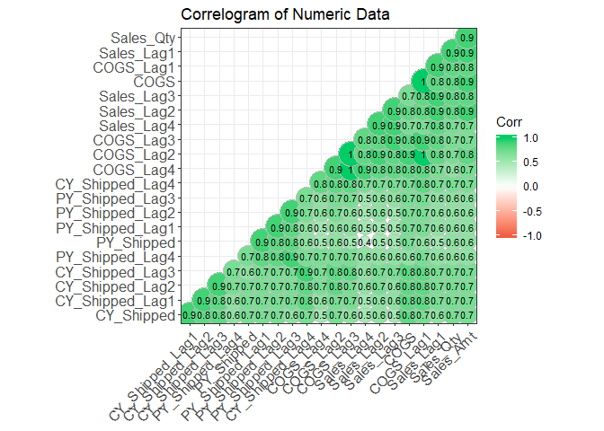<!-- -->

### Model creation
#### First, I need to scale all of the data so that I can determine the most important features later. Then I dummy all factor variables and create a test and training set.

#### Scale data

```r
preprocessParams<-preProcess(lagged_df, method = c("center", "scale"))
lagged_df <- predict(preprocessParams, lagged_df)
```

#### Dummy factor variables

```r
factor_vars <- names(lagged_df)[which(sapply(lagged_df,is.factor))]
dummies <- dummyVars(~.,lagged_df[factor_vars])
hot_coded <- predict(dummies,lagged_df[factor_vars])

numeric_vars <- names(lagged_df)[which(sapply(lagged_df,is.numeric))]
num_df <- lagged_df[numeric_vars]
model_df_onehot <- cbind(num_df,hot_coded)
```

#### Split the data based on year. 2015-2018 in the training set and 2019 in the validation test set.

```r
trainSet <- model_df_onehot[model_df_onehot$Date.Fiscal.Year..2019=='0',]
testSet <- model_df_onehot[model_df_onehot$Date.Fiscal.Year..2019=='1',]
```


#### Drop the Year variables so that we don't get any errors when running the models

```r
trainSet <- trainSet%>%
  select(-c(Date.Fiscal.Year..2015,Date.Fiscal.Year..2016, Date.Fiscal.Year..2017,Date.Fiscal.Year..2018,Date.Fiscal.Year..2019))

testSet <- testSet%>%
  select(-c(Date.Fiscal.Year..2015,Date.Fiscal.Year..2016, Date.Fiscal.Year..2017,Date.Fiscal.Year..2018,Date.Fiscal.Year..2019))
```

#### Create three models. A lasso,ridge, and linear model.

```r
TARGET.VAR <- "CY_Shipped"
candidate.features <- setdiff(names(trainSet),c(TARGET.VAR))
set.seed(123)
control <- trainControl(method="cv", 
                        number=5)


parameters <- c(seq(0.1, 2, by =0.1) ,  seq(2, 5, 0.5) , seq(5, 100, 1))

lasso<-train(x= trainSet[,candidate.features],
             y = trainSet[,TARGET.VAR],
             method = 'glmnet', 
             trControl=control,
             tuneGrid = expand.grid(alpha = 1, lambda = parameters) ,
             metric =  "RMSE")

ridge<-train(x= trainSet[,candidate.features],
             y = trainSet[,TARGET.VAR],
             method = 'glmnet', 
             trControl=control,
             tuneGrid = expand.grid(alpha = 0, lambda = parameters),
             metric =  "RMSE")

linear<-train(x= trainSet[,candidate.features],
              y = trainSet[,TARGET.VAR],
              trControl=control, 
              method = 'lm',
              metric =  "RMSE")
```


### Model Results
#### It looks like all the models did fairly well with the training data set with the Linear model outperforming in both RMSE and R-squared.

```r
model_list <- list(lasso=lasso,ridge=ridge,linear=linear)
summary(resamples(model_list))
```

```
## 
## Call:
## summary.resamples(object = resamples(model_list))
## 
## Models: lasso, ridge, linear 
## Number of resamples: 5 
## 
## MAE 
##              Min.    1st Qu.     Median       Mean    3rd Qu.       Max.
## lasso  0.09742777 0.09827569 0.09859958 0.09906175 0.09948065 0.10152508
## ridge  0.09296833 0.09415144 0.09491919 0.09456453 0.09495086 0.09583285
## linear 0.09348050 0.09440606 0.09516680 0.09531440 0.09595117 0.09756750
##        NA's
## lasso     0
## ridge     0
## linear    0
## 
## RMSE 
##             Min.   1st Qu.    Median      Mean   3rd Qu.      Max. NA's
## lasso  0.4092295 0.4208671 0.4242020 0.4268525 0.4355914 0.4443723    0
## ridge  0.3787219 0.3960977 0.3982898 0.4045070 0.4206382 0.4287874    0
## linear 0.3891585 0.3911724 0.3996394 0.4005655 0.4110404 0.4118168    0
## 
## Rsquared 
##             Min.   1st Qu.    Median      Mean   3rd Qu.      Max. NA's
## lasso  0.7877135 0.7920025 0.8000212 0.8052528 0.8015361 0.8449907    0
## ridge  0.7910908 0.8047406 0.8121815 0.8145672 0.8283172 0.8365058    0
## linear 0.8003835 0.8091260 0.8156204 0.8174309 0.8301179 0.8319066    0
```

### Variable Importance
#### Both the linear and ridge models had similar variables they deemed important. However, the lasso regression model tossed out all but 4 variables.This is due to multicollinearity in the data as seen in the correlation plot above. I will testing the data on more algorithms in a separte markdown. 

```r
plot(varImp(ridge),top=20)
```

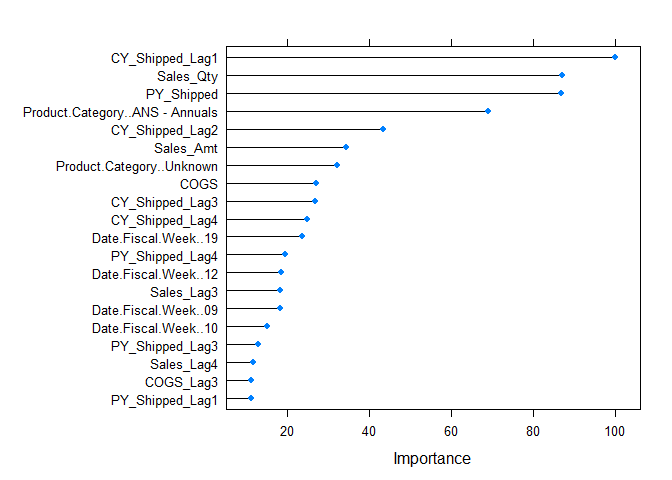<!-- -->

```r
plot(varImp(lasso),top=20)
```

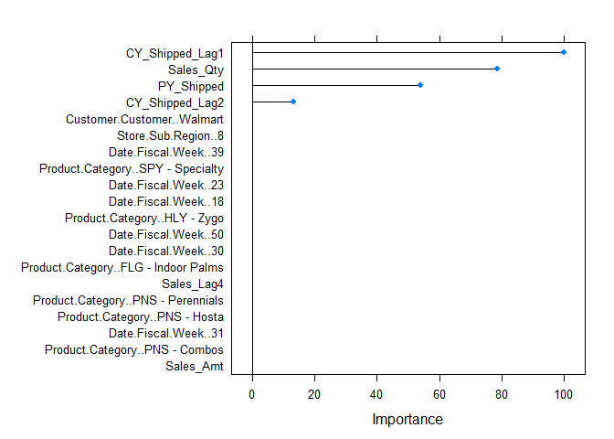<!-- -->

```r
plot(varImp(linear),top=20)
```

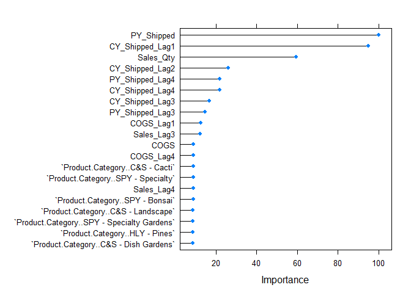<!-- -->


