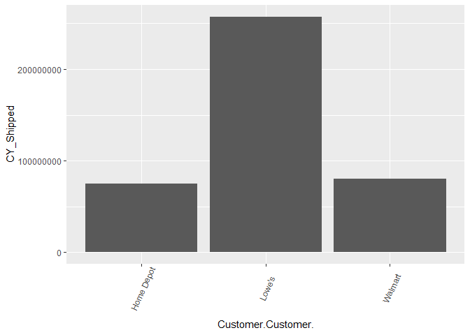

#### Load Data and look at data structure

```r
shipped_raw <- read.csv("POS Output v3.csv",stringsAsFactors=FALSE,fileEncoding="UTF-8-BOM")
shipped_data <- shipped_raw
kable(str(shipped_data))
```

```
## 'data.frame':	7195307 obs. of  15 variables:
##  $ Date.Fiscal.Year.     : int  2018 2018 2018 2018 2018 2018 2018 2018 2018 2018 ...
##  $ Date.Fiscal.Week.     : int  45 45 45 45 45 43 43 43 43 43 ...
##  $ Product.Sales.Code.   : chr  "LUB10" "LUB10" "LUB10" "LUB10" ...
##  $ Product.Macrocategory.: chr  "Foliage" "Foliage" "Foliage" "Foliage" ...
##  $ Product.Genus.        : chr  "Calathea" "Calathea" "Calathea" "Calathea" ...
##  $ X.Sales_Qty.          : int  114 103 25 16 18 2 20 66 62 14 ...
##  $ X.Shipped_Qty.        : int  0 0 10 NA 0 NA NA 25 30 50 ...
##  $ X.COGS.               : num  890 805 195 125 143 ...
##  $ Customer.Customer.    : chr  "Lowe's" "Lowe's" "Lowe's" "Lowe's" ...
##  $ Store.Macro.Region.   : chr  "SOUTHEAST" "SOUTHEAST" "SOUTHEAST" "SOUTHCENTRAL" ...
##  $ Store.Region.         : chr  "Region 2" "Region 2" "Region 2" "Region 7" ...
##  $ Store.Sub.Region.     : chr  "8" "7" "8.1" "9" ...
##  $ Product.Category.     : chr  "FLG - Large Indoor" "FLG - Large Indoor" "FLG - Large Indoor" "FLG - Large Indoor" ...
##  $ X.Sales_Amt.          : num  1139 803 221 177 133 ...
##  $ X.LY_Shipped_Qty.     : int  NA NA NA NA NA NA NA 15 38 NA ...
```

<table>
<tbody>
  <tr>

  </tr>
</tbody>
</table>

#### Check null values by column

```r
colSums(sapply(shipped_data,is.na))
```

```
##      Date.Fiscal.Year.      Date.Fiscal.Week.    Product.Sales.Code. 
##                  50159                  50159                      0 
## Product.Macrocategory.         Product.Genus.           X.Sales_Qty. 
##                      0                      0                 428379 
##         X.Shipped_Qty.                X.COGS.     Customer.Customer. 
##                5988538                 436720                      0 
##    Store.Macro.Region.          Store.Region.      Store.Sub.Region. 
##                      0                      0                      0 
##      Product.Category.           X.Sales_Amt.      X.LY_Shipped_Qty. 
##                      0                 428379                5938308
```

#### Drop rows that have null values for Year/Week and check nulls again

```r
shipped_data <- shipped_data[!is.na(shipped_data$Date.Fiscal.Year), ] 
colSums(sapply(shipped_data,is.na))
```

```
##      Date.Fiscal.Year.      Date.Fiscal.Week.    Product.Sales.Code. 
##                      0                      0                      0 
## Product.Macrocategory.         Product.Genus.           X.Sales_Qty. 
##                      0                      0                 378220 
##         X.Shipped_Qty.                X.COGS.     Customer.Customer. 
##                5938401                 386561                      0 
##    Store.Macro.Region.          Store.Region.      Store.Sub.Region. 
##                      0                      0                      0 
##      Product.Category.           X.Sales_Amt.      X.LY_Shipped_Qty. 
##                      0                 378220                5938308
```

#### Find the number of rows that Shipped Quantity are null for both this year and the prior year.

```r
nrow(shipped_data[is.na(shipped_data$X.Shipped_Qty.) & is.na(shipped_data$X.LY_Shipped_Qty.),])
```

```
## [1] 5217147
```

#### Find the percentage of rows that are missing for both year and last year as a percent of missing data

```r
nrow(shipped_data[is.na(shipped_data$X.Shipped_Qty.) & is.na(shipped_data$X.LY_Shipped_Qty.),])/nrow(shipped_data[is.na(shipped_data$X.Shipped_Qty.),])
```

```
## [1] 0.8785441
```
#### It looks like the Shipped Quantity data was joined to a larger data set which resulted in nulls for those combinations of columns that didn't join 1 for 1.

#### For now I will just replace the rows with null values with zeroes in order to keep the additional information stored in these rows.

```r
shipped_data$X.Shipped_Qty.[is.na(shipped_data$X.Shipped_Qty.)] <- 0
shipped_data$X.LY_Shipped_Qty.[is.na(shipped_data$X.LY_Shipped_Qty.)] <- 0
```

#Find the number of rows that are missing both Sales Qty and Sales Amount. Turns out to be the same rows.

```r
nrow(shipped_data[is.na(shipped_data$X.Sales_Qty.) & is.na(shipped_data$X.Sales_Amt.),])
```

```
## [1] 378220
```
#### Find the number of rows that are missing both Sales Qty and COGS. It seems there are a few additional rows missing for COGS, but for the most part they are both missing the same rows.

```r
nrow(shipped_data[is.na(shipped_data$X.Sales_Qty.) & is.na(shipped_data$X.COGS.),])
```

```
## [1] 378220
```

```r
nrow(shipped_data[is.na(shipped_data$X.Sales_Qty.) & is.na(shipped_data$X.COGS.),])/nrow(shipped_data[is.na(shipped_data$X.COGS.),])
```

```
## [1] 0.9784226
```
#### For now I will just change all these nulls to zero

```r
shipped_data[is.na(shipped_data)] <- 0
```

#### Create a date variable to view time series data. First, I have to add a zero in front of numbers 1 through 9 in order to be able to convert it correctly.

```r
shipped_data$Date.Fiscal.Week.[shipped_data$Date.Fiscal.Week.<10] <- paste0("0",shipped_data$Date.Fiscal.Week.[shipped_data$Date.Fiscal.Week.<10])
shipped_data$Date <- paste(shipped_data$Date.Fiscal.Year.,shipped_data$Date.Fiscal.Week.,sep = "-")
```


#### Change variables to correct data type

```r
rapply(shipped_data,function(x)length(unique(x)))
```

```
##      Date.Fiscal.Year.      Date.Fiscal.Week.    Product.Sales.Code. 
##                      6                     53                   5980 
## Product.Macrocategory.         Product.Genus.           X.Sales_Qty. 
##                     11                    542                   8563 
##         X.Shipped_Qty.                X.COGS.     Customer.Customer. 
##                   7777                 705971                      3 
##    Store.Macro.Region.          Store.Region.      Store.Sub.Region. 
##                      8                     14                     18 
##      Product.Category.           X.Sales_Amt.      X.LY_Shipped_Qty. 
##                     45                 861752                   7776 
##                   Date 
##                    310
```

```r
act_factors <- names(shipped_data)[which(sapply(shipped_data,function(x)length(unique(x))<=100)|sapply(shipped_data,is.character))]
shipped_data[act_factors]<- lapply(shipped_data[act_factors],factor)
kable(str(shipped_data))
```

```
## 'data.frame':	7145148 obs. of  16 variables:
##  $ Date.Fiscal.Year.     : Factor w/ 6 levels "2015","2016",..: 4 4 4 4 4 4 4 4 4 4 ...
##  $ Date.Fiscal.Week.     : Factor w/ 53 levels "01","02","03",..: 45 45 45 45 45 43 43 43 43 43 ...
##  $ Product.Sales.Code.   : Factor w/ 5980 levels "","1.00ACHFRV",..: 4360 4360 4360 4360 4360 4360 4360 4360 4360 4360 ...
##  $ Product.Macrocategory.: Factor w/ 11 levels "","Annuals","Blooming Tropicals",..: 6 6 6 6 6 6 6 6 6 6 ...
##  $ Product.Genus.        : Factor w/ 542 levels "","Acalypha",..: 79 79 79 79 79 79 79 79 79 79 ...
##  $ X.Sales_Qty.          : num  114 103 25 16 18 2 20 66 62 14 ...
##  $ X.Shipped_Qty.        : num  0 0 10 0 0 0 0 25 30 50 ...
##  $ X.COGS.               : num  890 805 195 125 143 ...
##  $ Customer.Customer.    : Factor w/ 3 levels "Home Depot","Lowe's",..: 2 2 2 2 2 2 2 2 2 2 ...
##  $ Store.Macro.Region.   : Factor w/ 8 levels "","N/A","NORTHEAST/CENTRAL",..: 6 6 6 5 5 6 5 6 6 6 ...
##  $ Store.Region.         : Factor w/ 14 levels "","N/A","Region 1",..: 7 7 7 12 12 7 12 7 7 7 ...
##  $ Store.Sub.Region.     : Factor w/ 18 levels "","#N/A","10",..: 14 13 15 16 14 12 16 13 14 15 ...
##  $ Product.Category.     : Factor w/ 45 levels "","ANS - Annuals",..: 23 23 23 23 23 23 23 23 23 23 ...
##  $ X.Sales_Amt.          : num  1139 803 221 177 133 ...
##  $ X.LY_Shipped_Qty.     : num  0 0 0 0 0 0 0 15 38 0 ...
##  $ Date                  : Factor w/ 310 levels "2015-01","2015-02",..: 204 204 204 204 204 202 202 202 202 202 ...
```

<table>
<tbody>
  <tr>

  </tr>
</tbody>
</table>

```r
rm(shipped_raw)
```

#### Next, I need to aggregate all my data by the group of variables that I want to build a forecast.

```r
shipped_agg <- shipped_data%>%
  group_by(Date.Fiscal.Year.,Date.Fiscal.Week.,Customer.Customer.,Store.Sub.Region.,Product.Category.,Date)%>%
  summarize(CY_Shipped = sum(X.Shipped_Qty.),
            PY_Shipped = sum(X.LY_Shipped_Qty.),
            COGS = sum(X.COGS.),
            Sales_Qty = sum(X.Sales_Qty.),
            Sales_Amt = sum(X.Sales_Amt.))

shipped_agg <- as.data.frame(shipped_agg)
```

#### Now I will inspect the data visually to see if anything abnormal catches my attention. First, I will inspect the Date variable I built earlier.

```r
my_breaks <- seq(1,length(unique(shipped_agg$Date)),by=10)

ggplot(shipped_agg, aes(x = Date, y=CY_Shipped )) +
  geom_bar(stat="identity") +
  theme(axis.text.x = element_text(angle=65, vjust=0.6))+
  scale_x_discrete(
    breaks=levels(shipped_agg$Date)[my_breaks])
```

<!-- -->

#### It's hard to tell but it looks like we are missing data at the end of our Date range. Let's check it out.

```r
shipped_agg%>%
  group_by(Date)%>%
  summarize(count=n(),
            total = sum(CY_Shipped))%>%
  rmarkdown::paged_table()
```

<div data-pagedtable="false">
  <script data-pagedtable-source type="application/json">
{"columns":[{"label":["Date"],"name":[1],"type":["fctr"],"align":["left"]},{"label":["count"],"name":[2],"type":["int"],"align":["right"]},{"label":["total"],"name":[3],"type":["dbl"],"align":["right"]}],"data":[{"1":"2015-01","2":"1104","3":"176314"},{"1":"2015-02","2":"1025","3":"475680"},{"1":"2015-03","2":"1025","3":"718916"},{"1":"2015-04","2":"1034","3":"768818"},{"1":"2015-05","2":"1002","3":"1265184"},{"1":"2015-06","2":"1010","3":"590407"},{"1":"2015-07","2":"1040","3":"589550"},{"1":"2015-08","2":"1012","3":"858661"},{"1":"2015-09","2":"1024","3":"1334855"},{"1":"2015-10","2":"1022","3":"1842944"},{"1":"2015-11","2":"1034","3":"2208468"},{"1":"2015-12","2":"1043","3":"3725464"},{"1":"2015-13","2":"1059","3":"3351484"},{"1":"2015-14","2":"1074","3":"3972595"},{"1":"2015-15","2":"1080","3":"3560389"},{"1":"2015-16","2":"1100","3":"3600819"},{"1":"2015-17","2":"1117","3":"3460655"},{"1":"2015-18","2":"1117","3":"3585257"},{"1":"2015-19","2":"1120","3":"2972426"},{"1":"2015-20","2":"1129","3":"3073670"},{"1":"2015-21","2":"1125","3":"2738860"},{"1":"2015-22","2":"1112","3":"2226360"},{"1":"2015-23","2":"1118","3":"1497526"},{"1":"2015-24","2":"1112","3":"1441926"},{"1":"2015-25","2":"1128","3":"1176588"},{"1":"2015-26","2":"1106","3":"1153929"},{"1":"2015-27","2":"1114","3":"776074"},{"1":"2015-28","2":"1120","3":"813471"},{"1":"2015-29","2":"1128","3":"868441"},{"1":"2015-30","2":"1126","3":"799869"},{"1":"2015-31","2":"1110","3":"1054440"},{"1":"2015-32","2":"1111","3":"594522"},{"1":"2015-33","2":"1102","3":"961393"},{"1":"2015-34","2":"1114","3":"1006242"},{"1":"2015-35","2":"1095","3":"900457"},{"1":"2015-36","2":"1096","3":"1056685"},{"1":"2015-37","2":"1094","3":"673180"},{"1":"2015-38","2":"1102","3":"1019734"},{"1":"2015-39","2":"1106","3":"1085217"},{"1":"2015-40","2":"1106","3":"943417"},{"1":"2015-41","2":"1103","3":"688043"},{"1":"2015-42","2":"1107","3":"508911"},{"1":"2015-43","2":"1123","3":"845380"},{"1":"2015-44","2":"1111","3":"1109528"},{"1":"2015-45","2":"1115","3":"1237812"},{"1":"2015-46","2":"1106","3":"756133"},{"1":"2015-47","2":"1113","3":"1096805"},{"1":"2015-48","2":"1099","3":"820066"},{"1":"2015-49","2":"1096","3":"553715"},{"1":"2015-50","2":"1092","3":"787819"},{"1":"2015-51","2":"1096","3":"734825"},{"1":"2015-52","2":"1093","3":"196751"},{"1":"2015-53","2":"1090","3":"922020"},{"1":"2016-01","2":"1087","3":"37166"},{"1":"2016-02","2":"1087","3":"651738"},{"1":"2016-03","2":"1078","3":"800541"},{"1":"2016-04","2":"1053","3":"547300"},{"1":"2016-05","2":"1041","3":"1266935"},{"1":"2016-06","2":"1039","3":"654449"},{"1":"2016-07","2":"1022","3":"943461"},{"1":"2016-08","2":"1042","3":"936292"},{"1":"2016-09","2":"1049","3":"1712264"},{"1":"2016-10","2":"1063","3":"1735562"},{"1":"2016-11","2":"1066","3":"3207721"},{"1":"2016-12","2":"1092","3":"3794607"},{"1":"2016-13","2":"1091","3":"4047196"},{"1":"2016-14","2":"1105","3":"3482648"},{"1":"2016-15","2":"1122","3":"3944928"},{"1":"2016-16","2":"1141","3":"3671362"},{"1":"2016-17","2":"1154","3":"3831141"},{"1":"2016-18","2":"1154","3":"3929474"},{"1":"2016-19","2":"1159","3":"3175573"},{"1":"2016-20","2":"1168","3":"3318393"},{"1":"2016-21","2":"1168","3":"2721664"},{"1":"2016-22","2":"1168","3":"2454912"},{"1":"2016-23","2":"1166","3":"1492611"},{"1":"2016-24","2":"1172","3":"1595307"},{"1":"2016-25","2":"1171","3":"1340768"},{"1":"2016-26","2":"1166","3":"1237812"},{"1":"2016-27","2":"1160","3":"1241507"},{"1":"2016-28","2":"1160","3":"676702"},{"1":"2016-29","2":"1162","3":"997467"},{"1":"2016-30","2":"1153","3":"813261"},{"1":"2016-31","2":"1155","3":"1560370"},{"1":"2016-32","2":"1149","3":"933326"},{"1":"2016-33","2":"1140","3":"782842"},{"1":"2016-34","2":"1140","3":"1013357"},{"1":"2016-35","2":"1144","3":"827290"},{"1":"2016-36","2":"1149","3":"1191819"},{"1":"2016-37","2":"1146","3":"908669"},{"1":"2016-38","2":"1148","3":"1151976"},{"1":"2016-39","2":"1145","3":"1014722"},{"1":"2016-40","2":"1162","3":"841974"},{"1":"2016-41","2":"1142","3":"547914"},{"1":"2016-42","2":"1154","3":"891777"},{"1":"2016-43","2":"1157","3":"806714"},{"1":"2016-44","2":"1158","3":"1171225"},{"1":"2016-45","2":"1151","3":"1077085"},{"1":"2016-46","2":"1155","3":"745533"},{"1":"2016-47","2":"1149","3":"812291"},{"1":"2016-48","2":"1144","3":"954714"},{"1":"2016-49","2":"1140","3":"647225"},{"1":"2016-50","2":"1136","3":"492482"},{"1":"2016-51","2":"1131","3":"857453"},{"1":"2016-52","2":"1121","3":"651736"},{"1":"2016-53","2":"1116","3":"1055611"},{"1":"2017-01","2":"1104","3":"507358"},{"1":"2017-02","2":"1090","3":"720732"},{"1":"2017-03","2":"1077","3":"1036649"},{"1":"2017-04","2":"1085","3":"1386120"},{"1":"2017-05","2":"1083","3":"1279695"},{"1":"2017-06","2":"1094","3":"1518976"},{"1":"2017-07","2":"1084","3":"1504738"},{"1":"2017-08","2":"1104","3":"2248669"},{"1":"2017-09","2":"1103","3":"2727403"},{"1":"2017-10","2":"1096","3":"3387558"},{"1":"2017-11","2":"1116","3":"2110491"},{"1":"2017-12","2":"1116","3":"2870845"},{"1":"2017-13","2":"1102","3":"3972457"},{"1":"2017-14","2":"1117","3":"3938165"},{"1":"2017-15","2":"1145","3":"4077093"},{"1":"2017-16","2":"1147","3":"3777769"},{"1":"2017-17","2":"1164","3":"4243976"},{"1":"2017-18","2":"1147","3":"3438270"},{"1":"2017-19","2":"1164","3":"2436509"},{"1":"2017-20","2":"1150","3":"2473438"},{"1":"2017-21","2":"1144","3":"3048414"},{"1":"2017-22","2":"1139","3":"1494081"},{"1":"2017-23","2":"1128","3":"1642386"},{"1":"2017-24","2":"1138","3":"1475733"},{"1":"2017-25","2":"1127","3":"1772163"},{"1":"2017-26","2":"1127","3":"1256671"},{"1":"2017-27","2":"1118","3":"927627"},{"1":"2017-28","2":"1123","3":"1020671"},{"1":"2017-29","2":"1099","3":"974178"},{"1":"2017-30","2":"1109","3":"1454635"},{"1":"2017-31","2":"1107","3":"843826"},{"1":"2017-32","2":"1101","3":"706822"},{"1":"2017-33","2":"1114","3":"898326"},{"1":"2017-34","2":"1106","3":"797766"},{"1":"2017-35","2":"1107","3":"1414836"},{"1":"2017-36","2":"1101","3":"785003"},{"1":"2017-37","2":"1106","3":"587984"},{"1":"2017-38","2":"1092","3":"1112209"},{"1":"2017-39","2":"1101","3":"1269767"},{"1":"2017-40","2":"1094","3":"602126"},{"1":"2017-41","2":"1109","3":"705206"},{"1":"2017-42","2":"1099","3":"1006947"},{"1":"2017-43","2":"1098","3":"891128"},{"1":"2017-44","2":"1085","3":"869906"},{"1":"2017-45","2":"1081","3":"705248"},{"1":"2017-46","2":"1095","3":"1094282"},{"1":"2017-47","2":"1089","3":"1001326"},{"1":"2017-48","2":"1093","3":"887124"},{"1":"2017-49","2":"1084","3":"872929"},{"1":"2017-50","2":"1077","3":"953712"},{"1":"2017-51","2":"1056","3":"463291"},{"1":"2017-52","2":"1053","3":"901877"},{"1":"2017-53","2":"1038","3":"0"},{"1":"2018-01","2":"1060","3":"325576"},{"1":"2018-02","2":"1065","3":"677086"},{"1":"2018-03","2":"1054","3":"594192"},{"1":"2018-04","2":"1058","3":"966243"},{"1":"2018-05","2":"1048","3":"1153339"},{"1":"2018-06","2":"1059","3":"1227725"},{"1":"2018-07","2":"1068","3":"1538160"},{"1":"2018-08","2":"1074","3":"2376844"},{"1":"2018-09","2":"1082","3":"2746304"},{"1":"2018-10","2":"1077","3":"3073629"},{"1":"2018-11","2":"1090","3":"2633524"},{"1":"2018-12","2":"1088","3":"3246326"},{"1":"2018-13","2":"1081","3":"2972258"},{"1":"2018-14","2":"1084","3":"3434567"},{"1":"2018-15","2":"1091","3":"3879499"},{"1":"2018-16","2":"1082","3":"3324898"},{"1":"2018-17","2":"1106","3":"3812500"},{"1":"2018-18","2":"1098","3":"3615039"},{"1":"2018-19","2":"1113","3":"3608791"},{"1":"2018-20","2":"1126","3":"3433668"},{"1":"2018-21","2":"1118","3":"2769745"},{"1":"2018-22","2":"1105","3":"2148625"},{"1":"2018-23","2":"1102","3":"1584570"},{"1":"2018-24","2":"1111","3":"1679610"},{"1":"2018-25","2":"1106","3":"1265381"},{"1":"2018-26","2":"1101","3":"1137080"},{"1":"2018-27","2":"1101","3":"901467"},{"1":"2018-28","2":"1111","3":"925816"},{"1":"2018-29","2":"1099","3":"1023262"},{"1":"2018-30","2":"1095","3":"1440600"},{"1":"2018-31","2":"1088","3":"1209750"},{"1":"2018-32","2":"1089","3":"1021708"},{"1":"2018-33","2":"1105","3":"766932"},{"1":"2018-34","2":"1087","3":"1035260"},{"1":"2018-35","2":"1085","3":"1446093"},{"1":"2018-36","2":"1078","3":"1162404"},{"1":"2018-37","2":"1078","3":"1282269"},{"1":"2018-38","2":"1079","3":"1345707"},{"1":"2018-39","2":"1082","3":"1284394"},{"1":"2018-40","2":"1080","3":"920550"},{"1":"2018-41","2":"1076","3":"857666"},{"1":"2018-42","2":"1076","3":"922532"},{"1":"2018-43","2":"1074","3":"1017598"},{"1":"2018-44","2":"1069","3":"1056534"},{"1":"2018-45","2":"1069","3":"915206"},{"1":"2018-46","2":"1063","3":"1117478"},{"1":"2018-47","2":"1058","3":"1032044"},{"1":"2018-48","2":"1060","3":"879955"},{"1":"2018-49","2":"1052","3":"813069"},{"1":"2018-50","2":"1050","3":"715880"},{"1":"2018-51","2":"1047","3":"493746"},{"1":"2018-52","2":"1057","3":"764003"},{"1":"2018-53","2":"1044","3":"57252"},{"1":"2019-01","2":"1048","3":"747982"},{"1":"2019-02","2":"1048","3":"794494"},{"1":"2019-03","2":"1050","3":"975622"},{"1":"2019-04","2":"1052","3":"1129077"},{"1":"2019-05","2":"1053","3":"1220011"},{"1":"2019-06","2":"1045","3":"1253905"},{"1":"2019-07","2":"1044","3":"1541032"},{"1":"2019-08","2":"1049","3":"1803261"},{"1":"2019-09","2":"1051","3":"2636057"},{"1":"2019-10","2":"1044","3":"2370363"},{"1":"2019-11","2":"1047","3":"2961700"},{"1":"2019-12","2":"1049","3":"3730900"},{"1":"2019-13","2":"1051","3":"3904287"},{"1":"2019-14","2":"1057","3":"4309552"},{"1":"2019-15","2":"1053","3":"4676142"},{"1":"2019-16","2":"1071","3":"4897571"},{"1":"2019-17","2":"1086","3":"5194951"},{"1":"2019-18","2":"1097","3":"4291125"},{"1":"2019-19","2":"1100","3":"4127173"},{"1":"2019-20","2":"1127","3":"4065942"},{"1":"2019-21","2":"1125","3":"3623816"},{"1":"2019-22","2":"1127","3":"1523581"},{"1":"2019-23","2":"1122","3":"1822741"},{"1":"2019-24","2":"1241","3":"1480971"},{"1":"2019-25","2":"1245","3":"1700950"},{"1":"2019-26","2":"1235","3":"1492285"},{"1":"2019-27","2":"1235","3":"1098727"},{"1":"2019-28","2":"1233","3":"941500"},{"1":"2019-29","2":"1230","3":"893052"},{"1":"2019-30","2":"1232","3":"1025655"},{"1":"2019-31","2":"1239","3":"1186058"},{"1":"2019-32","2":"1228","3":"1189090"},{"1":"2019-33","2":"1230","3":"1106885"},{"1":"2019-34","2":"1230","3":"1274547"},{"1":"2019-35","2":"1229","3":"1322772"},{"1":"2019-36","2":"1229","3":"671083"},{"1":"2019-37","2":"1225","3":"1216611"},{"1":"2019-38","2":"1228","3":"1091560"},{"1":"2019-39","2":"1226","3":"1208336"},{"1":"2019-40","2":"1228","3":"935742"},{"1":"2019-41","2":"1224","3":"802683"},{"1":"2019-42","2":"1230","3":"1011143"},{"1":"2019-43","2":"1234","3":"1060517"},{"1":"2019-44","2":"554","3":"273411"},{"1":"2019-45","2":"497","3":"167728"},{"1":"2019-46","2":"476","3":"136748"},{"1":"2019-47","2":"410","3":"0"},{"1":"2019-48","2":"442","3":"0"},{"1":"2019-49","2":"427","3":"0"},{"1":"2019-50","2":"368","3":"0"},{"1":"2019-51","2":"435","3":"0"},{"1":"2019-52","2":"457","3":"0"},{"1":"2019-53","2":"282","3":"34"},{"1":"2020-01","2":"355","3":"0"},{"1":"2020-02","2":"525","3":"0"},{"1":"2020-03","2":"537","3":"0"},{"1":"2020-04","2":"528","3":"0"},{"1":"2020-05","2":"563","3":"0"},{"1":"2020-06","2":"587","3":"0"},{"1":"2020-07","2":"620","3":"0"},{"1":"2020-08","2":"607","3":"0"},{"1":"2020-09","2":"594","3":"0"},{"1":"2020-10","2":"664","3":"0"},{"1":"2020-11","2":"679","3":"0"},{"1":"2020-12","2":"698","3":"0"},{"1":"2020-13","2":"724","3":"0"},{"1":"2020-14","2":"707","3":"0"},{"1":"2020-15","2":"709","3":"0"},{"1":"2020-16","2":"731","3":"0"},{"1":"2020-17","2":"710","3":"0"},{"1":"2020-18","2":"735","3":"0"},{"1":"2020-19","2":"714","3":"0"},{"1":"2020-20","2":"686","3":"0"},{"1":"2020-21","2":"700","3":"0"},{"1":"2020-22","2":"555","3":"0"},{"1":"2020-23","2":"612","3":"0"},{"1":"2020-24","2":"632","3":"0"},{"1":"2020-25","2":"647","3":"0"},{"1":"2020-26","2":"622","3":"0"},{"1":"2020-27","2":"580","3":"0"},{"1":"2020-28","2":"547","3":"0"},{"1":"2020-29","2":"559","3":"0"},{"1":"2020-30","2":"531","3":"0"},{"1":"2020-31","2":"577","3":"0"},{"1":"2020-32","2":"583","3":"0"},{"1":"2020-33","2":"561","3":"0"},{"1":"2020-34","2":"618","3":"0"},{"1":"2020-35","2":"620","3":"0"},{"1":"2020-36","2":"442","3":"0"},{"1":"2020-37","2":"525","3":"0"},{"1":"2020-38","2":"528","3":"0"},{"1":"2020-39","2":"517","3":"0"},{"1":"2020-40","2":"504","3":"0"},{"1":"2020-41","2":"462","3":"0"},{"1":"2020-42","2":"483","3":"0"},{"1":"2020-43","2":"487","3":"0"},{"1":"2020-44","2":"377","3":"0"},{"1":"2020-45","2":"42","3":"0"}],"options":{"columns":{"min":{},"max":[10]},"rows":{"min":[10],"max":[10]},"pages":{}}}
  </script>
</div>

```r
shipped_agg <- shipped_agg%>%
  filter(as.integer(Date) %in% c(1:255))%>%
  droplevels
```

#### Let's check it out again. Looks good!

```r
my_breaks <- seq(1,length(unique(shipped_agg$Date)),by=10)

ggplot(shipped_agg, aes(x = Date, y=CY_Shipped )) +
  geom_bar(stat="identity") +
  theme(axis.text.x = element_text(angle=65, vjust=0.6))+
  scale_x_discrete(
    breaks=levels(shipped_agg$Date)[my_breaks])
```

<!-- -->


#### By Year

```r
ggplot(shipped_agg, aes(x = Date.Fiscal.Year., y=CY_Shipped )) +
  geom_bar(stat="identity") +
  theme(axis.text.x = element_text(angle=65, vjust=0.6))
```

<!-- -->


#### By Week

```r
ggplot(shipped_agg, aes(x = Date.Fiscal.Week. , y= CY_Shipped)) +
  geom_bar(stat="identity") +
  theme(axis.text.x = element_text(angle=65, vjust=0.6))
```

<!-- -->


#### By Customer

```r
ggplot(shipped_agg, aes(x = Customer.Customer. , y= CY_Shipped)) +
  geom_bar(stat="identity") +
  theme(axis.text.x = element_text(angle=65, vjust=0.6))
```

<!-- -->


#### By Store Sub Region

```r
ggplot(shipped_agg, aes(x = Store.Sub.Region. , y= CY_Shipped)) +
  geom_bar(stat="identity") +
  theme(axis.text.x = element_text(angle=65, vjust=0.6))
```

<!-- -->


#### It looks like we need to get rid of blank and n/a levels in Store Region

```r
shipped_agg%>%
  group_by(Store.Sub.Region.)%>%
  summarize(count=n(),
            total = sum(CY_Shipped),
            ave=mean(CY_Shipped))%>%
  rmarkdown::paged_table()
```

<div data-pagedtable="false">
  <script data-pagedtable-source type="application/json">
{"columns":[{"label":["Store.Sub.Region."],"name":[1],"type":["fctr"],"align":["left"]},{"label":["count"],"name":[2],"type":["int"],"align":["right"]},{"label":["total"],"name":[3],"type":["dbl"],"align":["right"]},{"label":["ave"],"name":[4],"type":["dbl"],"align":["right"]}],"data":[{"1":"","2":"157","3":"0","4":"0.000000"},{"1":"#N/A","2":"174","3":"0","4":"0.000000"},{"1":"10","2":"24832","3":"32071188","4":"1291.526579"},{"1":"10.1","2":"22568","3":"12992922","4":"575.723236"},{"1":"11","2":"7575","3":"136303","4":"17.993795"},{"1":"12","2":"6878","3":"540728","4":"78.617040"},{"1":"13","2":"7092","3":"797166","4":"112.403553"},{"1":"2","2":"707","3":"1187","4":"1.678925"},{"1":"3","2":"10708","3":"202581","4":"18.918659"},{"1":"4","2":"17334","3":"3433286","4":"198.066574"},{"1":"5","2":"19491","3":"17632493","4":"904.647940"},{"1":"6","2":"22677","3":"53715734","4":"2368.731931"},{"1":"7","2":"27946","3":"93250596","4":"3336.813712"},{"1":"8","2":"28444","3":"94140291","4":"3309.671319"},{"1":"8.1","2":"24132","3":"21391450","4":"886.435024"},{"1":"9","2":"26022","3":"53115353","4":"2041.171048"},{"1":"9.1","2":"23708","3":"28201860","4":"1189.550363"},{"1":"N/A","2":"12238","3":"795341","4":"64.989459"}],"options":{"columns":{"min":{},"max":[10]},"rows":{"min":[10],"max":[10]},"pages":{}}}
  </script>
</div>

```r
shipped_agg <- shipped_agg%>%
  filter(!Store.Sub.Region. %in% c("","#N/A",'2'))%>%
  droplevels
```


#### By Product Category

```r
ggplot(shipped_agg, aes(x = Product.Category. , y= CY_Shipped)) +
  geom_bar(stat="identity") +
  theme(axis.text.x = element_text(angle=65, vjust=0.6))
```

<!-- -->


#### It looks like we need to get rid of a blank level in Product Category

```r
shipped_agg%>%
  group_by(Product.Category.)%>%
  summarize(count=n(),
            total = sum(CY_Shipped))%>%
  rmarkdown::paged_table()
```

<div data-pagedtable="false">
  <script data-pagedtable-source type="application/json">
{"columns":[{"label":["Product.Category."],"name":[1],"type":["fctr"],"align":["left"]},{"label":["count"],"name":[2],"type":["int"],"align":["right"]},{"label":["total"],"name":[3],"type":["dbl"],"align":["right"]}],"data":[{"1":"","2":"130","3":"0"},{"1":"ANS - Annuals","2":"5255","3":"112779933"},{"1":"ANS - Bulb","2":"1236","3":"160781"},{"1":"ANS - Combos","2":"3740","3":"1770680"},{"1":"ANS - Edible","2":"1933","3":"42887"},{"1":"ANS - Ferns","2":"2283","3":"511271"},{"1":"ANS - Mums","2":"4079","3":"8451513"},{"1":"ANS - Pansy","2":"2914","3":"7729403"},{"1":"Blooming Tropicals","2":"20","3":"918"},{"1":"BTS - Combos","2":"6999","3":"686589"},{"1":"BTS - Hibiscus","2":"9239","3":"11669884"},{"1":"BTS - Mandevilla","2":"9284","3":"13060827"},{"1":"BTS - Patio Tropicals","2":"9039","3":"3507474"},{"1":"BTS - Shrubs","2":"8668","3":"4502993"},{"1":"C&S - Cacti","2":"9337","3":"3014441"},{"1":"C&S - Dish Gardens","2":"8032","3":"978072"},{"1":"C&S - Landscape","2":"8582","3":"2410353"},{"1":"C&S - Succulents","2":"8446","3":"8130707"},{"1":"FLG - Baskets","2":"9592","3":"7747728"},{"1":"FLG - Combos","2":"7848","3":"602276"},{"1":"FLG - Indoor Palms","2":"9671","3":"9658999"},{"1":"FLG - Landscape Palms","2":"6601","3":"220809"},{"1":"FLG - Large Indoor","2":"9704","3":"13004025"},{"1":"FLG - Shrubs","2":"9506","3":"9114587"},{"1":"FLG - Small Indoor","2":"9772","3":"51483707"},{"1":"FNS - Boston","2":"8684","3":"6270254"},{"1":"HLY - Pines","2":"8089","3":"3220867"},{"1":"HLY - Poinsettias","2":"3479","3":"6173471"},{"1":"HLY - Zygo","2":"5080","3":"472828"},{"1":"N/A","2":"9382","3":"36745837"},{"1":"PNS - Combos","2":"2700","3":"191704"},{"1":"PNS - Ferns","2":"1975","3":"691902"},{"1":"PNS - Grass","2":"3276","3":"3640043"},{"1":"PNS - Ground Cover","2":"2799","3":"6649366"},{"1":"PNS - Hosta","2":"2244","3":"4909560"},{"1":"PNS - Lily","2":"5154","3":"7984826"},{"1":"PNS - Perennials","2":"5218","3":"21069047"},{"1":"PNS - Vining","2":"1643","3":"533286"},{"1":"SPY - Bonsai","2":"9354","3":"1624706"},{"1":"SPY - Bromeliad & Anthuriums","2":"9403","3":"4665225"},{"1":"SPY - Lucky Bamboo","2":"9420","3":"5440838"},{"1":"SPY - Orchids","2":"7440","3":"3881219"},{"1":"SPY - Specialty","2":"9173","3":"1060674"},{"1":"SPY - Specialty Gardens","2":"8338","3":"583502"},{"1":"Unknown","2":"6884","3":"25367280"}],"options":{"columns":{"min":{},"max":[10]},"rows":{"min":[10],"max":[10]},"pages":{}}}
  </script>
</div>

```r
shipped_agg <- shipped_agg%>%
  filter(!Product.Category. %in% c("","Blooming Tropicals"))%>%
  droplevels
```


#### A very important step in this project was to create lagged version of all my Shipping, Sales, and COGS data. First, I must create a data frame that has a row for every unique combination of Customer/Store Sub Region/Product Category/Date. Then, I need to join this data back to my original data set so that the lag function is able to correctly create a lagged number. Finally, I created 4 lagged variables for each of the Shipping, Sales, and COGS variables.


```r
lagged_df = expand.grid(
  Customer.Customer. = sort(unique(shipped_agg$Customer.Customer.)),
  Store.Sub.Region. = sort(unique(shipped_agg$Store.Sub.Region.)),
  Product.Category. = sort(unique(shipped_agg$Product.Category.)),
  Date = sort(unique(shipped_agg$Date))) %>% 
  left_join(shipped_agg, by = c("Customer.Customer.","Store.Sub.Region.","Product.Category.","Date")) %>% 
  arrange(Customer.Customer.,Store.Sub.Region.,Product.Category.,Date) %>% 
  group_by(Customer.Customer.,Store.Sub.Region.,Product.Category.) %>% 
  mutate(CY_Shipped_Lag1 = lag(CY_Shipped,n = 1),
         CY_Shipped_Lag2 = lag(CY_Shipped,n = 2),
         CY_Shipped_Lag3 = lag(CY_Shipped,n = 3),
         CY_Shipped_Lag4 = lag(CY_Shipped,n = 4),
         PY_Shipped_Lag1 = lag(PY_Shipped,n = 1),
         PY_Shipped_Lag2 = lag(PY_Shipped,n = 2),
         PY_Shipped_Lag3 = lag(PY_Shipped,n = 3),
         PY_Shipped_Lag4 = lag(PY_Shipped,n = 4),
         Sales_Lag1 = lag(Sales_Amt,n = 1),
         Sales_Lag2 = lag(Sales_Amt,n = 2),
         Sales_Lag3 = lag(Sales_Amt,n = 3),
         Sales_Lag4 = lag(Sales_Amt,n = 4),
         COGS_Lag1 = lag(COGS,n = 1),
         COGS_Lag2 = lag(COGS,n = 2),
         COGS_Lag3 = lag(COGS,n = 3),
         COGS_Lag4 = lag(COGS,n = 4)) %>% 
  ungroup()
```


#### Determine how many null values are in the new data set. Year, Week, Sales, and Cogs are all missing the same data from the join in the previous step.

```r
colSums(sapply(lagged_df,is.na))
```

```
## Customer.Customer.  Store.Sub.Region.  Product.Category. 
##                  0                  0                  0 
##               Date  Date.Fiscal.Year.  Date.Fiscal.Week. 
##                  0             211930             211930 
##         CY_Shipped         PY_Shipped               COGS 
##             211930             211930             211930 
##          Sales_Qty          Sales_Amt    CY_Shipped_Lag1 
##             211930             211930             213146 
##    CY_Shipped_Lag2    CY_Shipped_Lag3    CY_Shipped_Lag4 
##             214359             215564             216773 
##    PY_Shipped_Lag1    PY_Shipped_Lag2    PY_Shipped_Lag3 
##             213146             214359             215564 
##    PY_Shipped_Lag4         Sales_Lag1         Sales_Lag2 
##             216773             213146             214359 
##         Sales_Lag3         Sales_Lag4          COGS_Lag1 
##             215564             216773             213146 
##          COGS_Lag2          COGS_Lag3          COGS_Lag4 
##             214359             215564             216773
```


#### Drop the missing values that were created during the join.

```r
lagged_df <- lagged_df[!is.na(lagged_df$Date.Fiscal.Week.),] 
```


#### Drop the missing values that were created by lagging

```r
lagged_df <- as.data.frame(lagged_df[complete.cases(lagged_df),])

lagged_df <- lagged_df%>%
  select(-c("Date"))

colSums(sapply(lagged_df,is.na))
```

```
## Customer.Customer.  Store.Sub.Region.  Product.Category. 
##                  0                  0                  0 
##  Date.Fiscal.Year.  Date.Fiscal.Week.         CY_Shipped 
##                  0                  0                  0 
##         PY_Shipped               COGS          Sales_Qty 
##                  0                  0                  0 
##          Sales_Amt    CY_Shipped_Lag1    CY_Shipped_Lag2 
##                  0                  0                  0 
##    CY_Shipped_Lag3    CY_Shipped_Lag4    PY_Shipped_Lag1 
##                  0                  0                  0 
##    PY_Shipped_Lag2    PY_Shipped_Lag3    PY_Shipped_Lag4 
##                  0                  0                  0 
##         Sales_Lag1         Sales_Lag2         Sales_Lag3 
##                  0                  0                  0 
##         Sales_Lag4          COGS_Lag1          COGS_Lag2 
##                  0                  0                  0 
##          COGS_Lag3          COGS_Lag4 
##                  0                  0
```

### Model creation
#### First, I need to scale all of the data so that I can determine the most important features later. Then I dummy all factor variables and create a test and training set.

#### Scale data

```r
preprocessParams<-preProcess(lagged_df, method = c("center", "scale"))
lagged_df <- predict(preprocessParams, lagged_df)
```

#### Dummy factor variables

```r
factor_vars <- names(lagged_df)[which(sapply(lagged_df,is.factor))]
dummies <- dummyVars(~.,lagged_df[factor_vars])
hot_coded <- predict(dummies,lagged_df[factor_vars])

numeric_vars <- names(lagged_df)[which(sapply(lagged_df,is.numeric))]
num_df <- lagged_df[numeric_vars]
model_df_onehot <- cbind(num_df,hot_coded)
```

#### Split the data based on year. 2015-2018 in the training set and 2019 in the validation test set.

```r
trainSet <- model_df_onehot[model_df_onehot$Date.Fiscal.Year..2019=='0',]
testSet <- model_df_onehot[model_df_onehot$Date.Fiscal.Year..2019=='1',]
```


#### Drop Year variable so that we don't get any errors

```r
trainSet <- trainSet%>%
  select(-c(Date.Fiscal.Year..2015,Date.Fiscal.Year..2016, Date.Fiscal.Year..2017,Date.Fiscal.Year..2018,Date.Fiscal.Year..2019))

testSet <- testSet%>%
  select(-c(Date.Fiscal.Year..2015,Date.Fiscal.Year..2016, Date.Fiscal.Year..2017,Date.Fiscal.Year..2018,Date.Fiscal.Year..2019))
```

#### Create three models. A lasso,ridge, and linear model.

```r
TARGET.VAR <- "CY_Shipped"
candidate.features <- setdiff(names(trainSet),c(TARGET.VAR))
set.seed(123)
control <- trainControl(method="cv", 
                        number=5)


parameters <- c(seq(0.1, 2, by =0.1) ,  seq(2, 5, 0.5) , seq(5, 100, 1))

lasso<-train(x= trainSet[,candidate.features],
             y = trainSet[,TARGET.VAR],
             method = 'glmnet', 
             trControl=control,
             tuneGrid = expand.grid(alpha = 1, lambda = parameters) ,
             metric =  "RMSE")

ridge<-train(x= trainSet[,candidate.features],
             y = trainSet[,TARGET.VAR],
             method = 'glmnet', 
             trControl=control,
             tuneGrid = expand.grid(alpha = 0, lambda = parameters),
             metric =  "RMSE")

linear<-train(x= trainSet[,candidate.features],
              y = trainSet[,TARGET.VAR],
              trControl=control, 
              method = 'lm',
              metric =  "RMSE")
```


#### Model Results

```r
model_list <- list(lasso=lasso,ridge=ridge,linear=linear)
summary(resamples(model_list))
```

```
## 
## Call:
## summary.resamples(object = resamples(model_list))
## 
## Models: lasso, ridge, linear 
## Number of resamples: 5 
## 
## MAE 
##              Min.    1st Qu.     Median       Mean    3rd Qu.       Max.
## lasso  0.09742777 0.09827569 0.09859958 0.09906175 0.09948065 0.10152508
## ridge  0.09296833 0.09415144 0.09491919 0.09456453 0.09495086 0.09583285
## linear 0.09348050 0.09440606 0.09516680 0.09531440 0.09595117 0.09756750
##        NA's
## lasso     0
## ridge     0
## linear    0
## 
## RMSE 
##             Min.   1st Qu.    Median      Mean   3rd Qu.      Max. NA's
## lasso  0.4092295 0.4208671 0.4242020 0.4268525 0.4355914 0.4443723    0
## ridge  0.3787219 0.3960977 0.3982898 0.4045070 0.4206382 0.4287874    0
## linear 0.3891585 0.3911724 0.3996394 0.4005655 0.4110404 0.4118168    0
## 
## Rsquared 
##             Min.   1st Qu.    Median      Mean   3rd Qu.      Max. NA's
## lasso  0.7877135 0.7920025 0.8000212 0.8052528 0.8015361 0.8449907    0
## ridge  0.7910908 0.8047406 0.8121815 0.8145672 0.8283172 0.8365058    0
## linear 0.8003835 0.8091260 0.8156204 0.8174309 0.8301179 0.8319066    0
```


#### Look at variable importance

```r
plot(varImp(ridge),top=20)
```

<!-- -->

```r
plot(varImp(lasso),top=20)
```

<!-- -->

```r
plot(varImp(linear),top=20)
```

<!-- -->


[Return to my portfolio](https://dustinrogers.github.io/)


